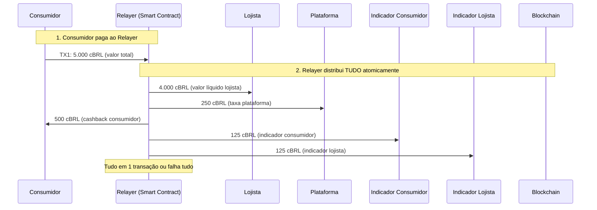
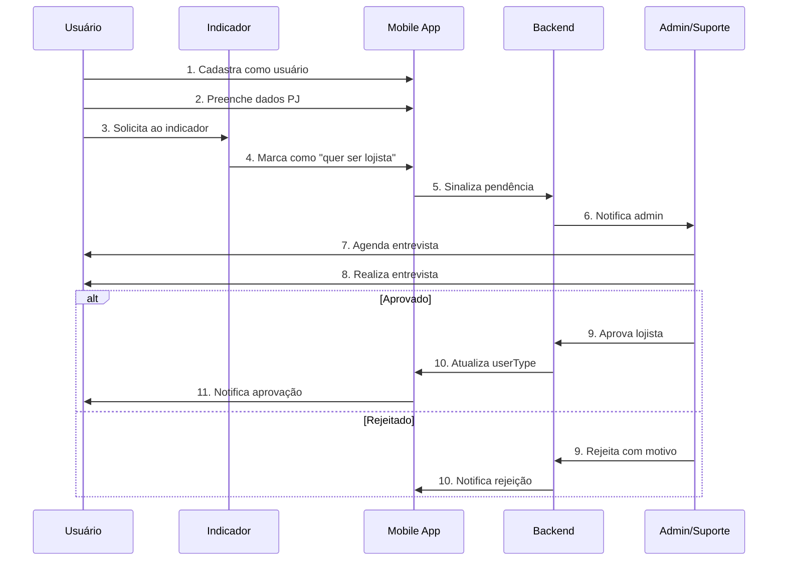
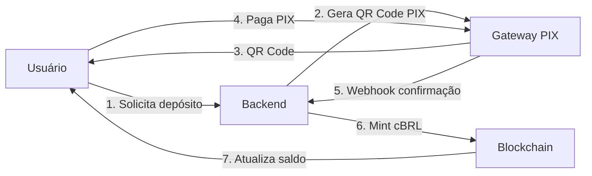
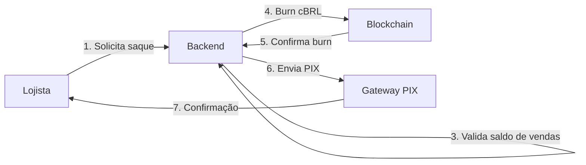
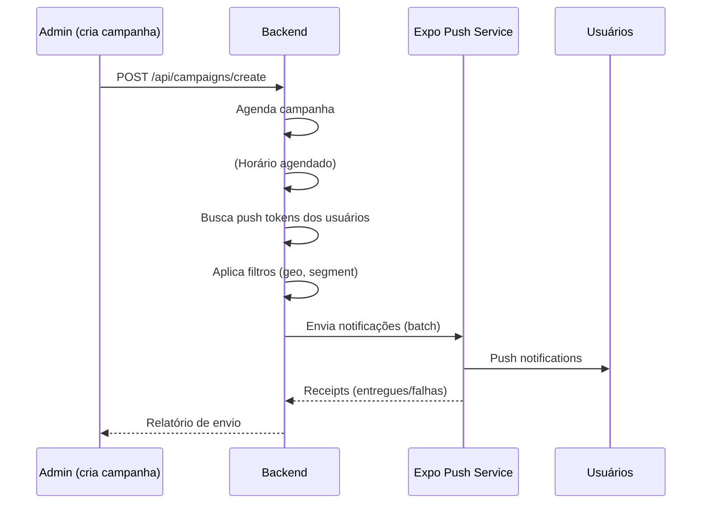
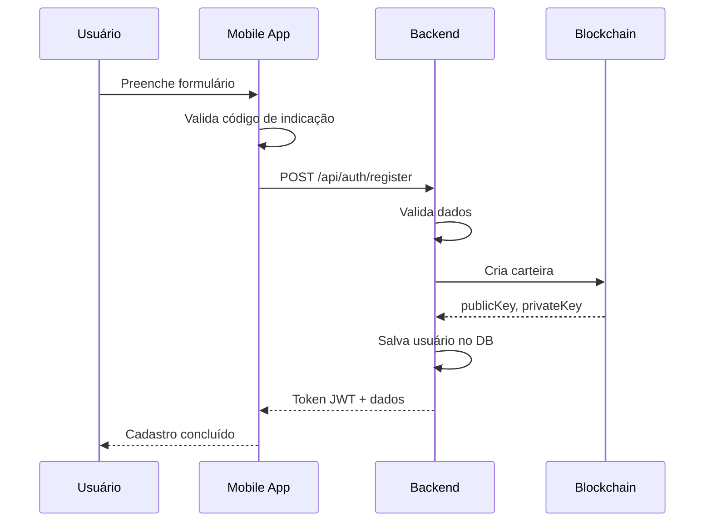
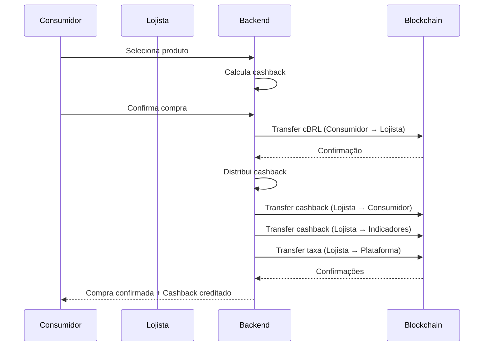
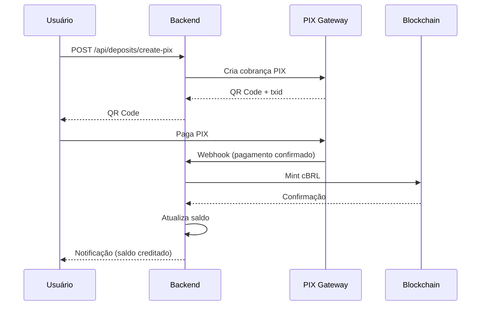
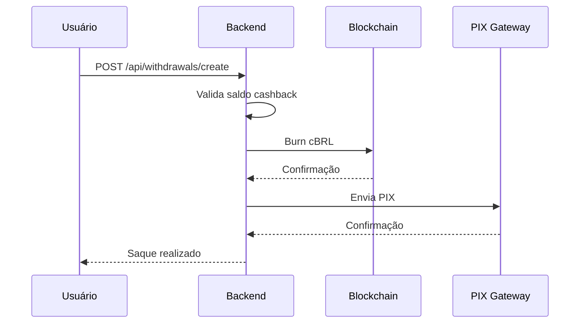

# 🎯 CORE BUSINESS - Clube Digital

> **Documento de Referência Principal**
> Define as regras de negócio, conceitos fundamentais e estratégias do Clube Digital.
> **Este documento é a fonte da verdade para implementações futuras.**
> **Versão**: 2.2.0
> **Atualizado em**: 2025-11-06

---

## 📌 Índice

1. [Visão Geral](#-visão-geral)
2. [Conceito do Negócio](#-conceito-do-negócio)
3. [Arquitetura Multi-Tenant](#-arquitetura-multi-tenant)
4. [Arquitetura do Sistema](#-arquitetura-do-sistema)
5. [Sistema de Cashback](#-sistema-de-cashback)
6. [Modelo de Receita SaaS](#-modelo-de-receita-saas-mensalidades-e-taxas)
7. [Sistema de Indicações](#-sistema-de-indicações)
8. [Gestão de Usuários](#-gestão-de-usuários)
9. [Sistema Financeiro](#-sistema-financeiro)
10. [Blockchain e cBRL](#-blockchain-e-cbrl)
11. [Sistema de Módulos](#-sistema-de-módulos)
12. [Comunicação em Massa](#-comunicação-em-massa)
13. [Categorias de Produtos](#-categorias-de-produtos)
14. [Fluxos Críticos](#-fluxos-críticos)
15. [Regras de Negócio](#-regras-de-negócio)

---

## 🎯 Visão Geral

O **Clube Digital** é uma **plataforma multi-tenant whitelabel SaaS** de clube de benefícios e cashback que conecta **consumidores** e **lojistas** através de um sistema de incentivos financeiros baseado em indicações e cashback.

### Modelo Multi-Tenant

O Clube Digital opera como **sistema central** que cria aplicações whitelabel para múltiplas empresas (tenants):

- **1 sistema central** → **N empresas clientes** (tenants)
- Cada tenant tem:
  - ✅ Seu próprio app iOS e Android nas lojas
  - ✅ Seu próprio banco de dados isolado
  - ✅ Sua própria marca (logos, cores, nome)
  - ✅ Seus próprios usuários e lojistas
  - ✅ Seus próprios módulos habilitados/desabilitados
  - ✅ Seu próprio admin web (subdomínio)

**Isolamento Total**: Usuários da Empresa A não veem ou acessam dados da Empresa B.

### Moeda da Plataforma: cBRL

**IMPORTANTE**: Toda moeda circulante dentro do app é o **cBRL** (Clube Real), um token da rede blockchain Azore com **paridade 1:1 com o Real Brasileiro (BRL)**.

- **Token**: cBRL (ERC-20)
- **Blockchain**: Azore Network
- **Paridade**: 1 cBRL = 1 BRL
- **Origem**: Mesma moeda utilizada pela [Coinage.trade](https://coinage.trade), corretora e tokenizadora de ativos digitais
- **Cashback**: Sempre creditado em cBRL
- **Compras**: Sempre processadas em cBRL
- **Saques**: Convertidos de cBRL para BRL via PIX

### Objetivo Principal
Fortalecer o mercado local criando uma rede de indicações onde:
- **Consumidores** recebem cashback em cBRL
- **Lojistas** aumentam vendas através de indicações e recebem em cBRL
- **Indicadores** ganham parte do cashback em cBRL
- **Plataforma** se sustenta através de taxas em cBRL

---

## 💡 Conceito do Negócio

### Modelo de Clube de Benefícios

O Clube Digital opera como um **clube fechado por indicação**:

1. **Entrada obrigatória via indicação**
   - Não é possível se cadastrar sem um código de indicação
   - Cria uma rede de confiança e rastreabilidade
   - Incentiva o crescimento orgânico

2. **Duas categorias de membros**
   - **Consumidores**: Compram produtos/serviços e recebem cashback em cBRL
   - **Lojistas**: Vendem produtos/serviços, oferecem cashback e podem sacar suas vendas

3. **Sistema multinível de indicações**
   - Usuários podem indicar tanto consumidores quanto futuros lojistas
   - Cada indicação gera receita passiva em cBRL para o indicador
   - Indicadores de lojistas aprovados ganham 12,5% do cashback de cada venda

---

## 🏢 Arquitetura Multi-Tenant

### Visão Geral Multi-Tenant

O Clube Digital é projetado como **plataforma SaaS multi-tenant** onde cada empresa cliente (tenant) opera com **isolamento total** de dados e identidade visual própria.

### Estratégia: Database per Tenant

**Decisão**: Cada tenant tem seu próprio banco de dados PostgreSQL.

```
clube_digital_master       ← Metadata de todos os tenants
clube_digital_empresa_a    ← Dados isolados do Tenant A
clube_digital_empresa_b    ← Dados isolados do Tenant B
clube_digital_empresa_c    ← Dados isolados do Tenant C
```

**Vantagens**:
- ✅ **Isolamento total**: Impossível um tenant acessar dados de outro
- ✅ **LGPD/Compliance**: Facilita conformidade regulatória
- ✅ **Performance**: Cada tenant tem performance independente
- ✅ **Backup individual**: Restauração por tenant sem afetar outros
- ✅ **Migrations unificadas**: 1 comando migra todos os bancos

### Master Database

O banco `clube_digital_master` armazena **apenas metadados** dos tenants:

**Dados Armazenados**:
```typescript
// Master DB contém:
- Informações do tenant (slug, nome, status)
- Credenciais do banco de dados do tenant (criptografadas)
- Configurações de branding (logos, cores)
- Módulos habilitados/desabilitados (padrão do tenant)
- Admins do tenant
- URLs (subdomain, custom domain)
- Dados de app mobile (bundle ID, app store)
- Analytics agregado (TenantStats, GlobalStats)
  - Totais de usuários, receita, cashback
  - Métricas de crescimento
  - Ranking de performance
```

**NÃO armazena**:
- ❌ Usuários finais individuais (consumidores/lojistas)
- ❌ Dados pessoais / PII (LGPD)
- ❌ Produtos ou compras individuais
- ❌ Transações financeiras detalhadas
- ❌ Histórico de cashback detalhado
- ❌ Módulos individuais por usuário (isso fica no tenant DB)

### Tenant Databases

Cada banco de tenant contém **todos os dados da operação**:

```typescript
// Tenant DB (empresa_a, empresa_b, etc) contém:
- Users (consumidores e lojistas)
- UserModule (módulos individuais por usuário)
- Products (catálogo de produtos)
- Purchases (compras e transações)
- Referrals (indicações)
- Notifications (notificações)
- Campaigns (campanhas de marketing)
- UserPushToken (tokens de push notification)
- KYC documents
```

### Identificação de Tenant

**Mobile App**: Tenant identificado via `X-Tenant-ID` header
```typescript
// apps/mobile - ao fazer requests
headers: {
  'X-Tenant-ID': 'uuid-do-tenant',
  'Authorization': 'Bearer jwt-token'
}
```

**Admin Web**: Tenant identificado via subdomain
```
empresa-a.admin.clubedigital.com.br  → Tenant A
empresa-b.admin.clubedigital.com.br  → Tenant B
```

### Resolução de Tenant no Backend

```javascript
// apps/api/src/middleware/tenant.middleware.js
async function resolveTenant(req, res, next) {
  let tenant = null;

  // 1. Mobile: Por tenant ID
  const tenantId = req.headers['x-tenant-id'];
  if (tenantId) {
    tenant = await masterPrisma.tenant.findUnique({
      where: { id: tenantId }
    });
  }

  // 2. Admin Web: Por subdomain
  if (!tenant) {
    const subdomain = extractSubdomain(req.headers.host);
    tenant = await masterPrisma.tenant.findFirst({
      where: { subdomain }
    });
  }

  // 3. Conectar ao banco específico do tenant
  req.tenant = tenant;
  req.tenantPrisma = getTenantPrisma(tenant);

  next();
}
```

### Mobile: Apps Separados + EAS Update

**Estratégia Escolhida**: Cada tenant tem seu próprio app nas lojas, mas todos compartilham o mesmo código JavaScript.

#### Ciclo de Vida do App

**1. Build Inicial (Uma vez por tenant)**
```bash
# Criar build para Empresa A
TENANT_SLUG=empresa-a eas build --platform all

# App publicado:
# iOS: "Clube Empresa A" (com.clubedigital.empresaa)
# Android: "Clube Empresa A" (com.clubedigital.empresaa)
```

**2. Updates de Código (Todos os apps simultaneamente)**
```bash
# Um único comando atualiza TODOS os apps mobile
eas update --message "Nova feature de cashback"

# Resultado:
# ✅ App Empresa A atualizado (instantâneo)
# ✅ App Empresa B atualizado (instantâneo)
# ✅ App Empresa C atualizado (instantâneo)
# Tempo: ~15 minutos para TODOS
```

**Quando fazer Build vs Update**:

| Ação | Quando | Review Store? | Tempo |
|------|--------|---------------|-------|
| **Build inicial** | Setup do tenant | ✅ Sim | ~2 dias |
| **Update de código** | Toda mudança JS/features | ❌ Não | Instantâneo |
| **Rebuild** | Mudança de native code | ✅ Sim | ~2 dias |

**Vantagens**:
- ✅ **1 deploy** atualiza todos os apps
- ✅ **Sem review** da App Store para 99% das mudanças
- ✅ **Identidade própria** nas lojas (nome, logo único)
- ✅ **Isolamento** total entre tenants

### Migrations Multi-Tenant

**1 comando migra TODOS os bancos de dados**:

```bash
# Script: scripts/migrate-all-tenants.js
npm run db:migrate:all

# O que acontece:
# 1. Busca todos os tenants ativos no master DB
# 2. Para cada tenant:
#    - Conecta ao banco específico
#    - Roda prisma migrate deploy
#    - Registra sucesso/erro
# 3. Retorna relatório completo
```

### Super-Admin vs Tenant Admin

**Super-Admin** (acesso ao sistema central):
- ✅ Vê todos os tenants
- ✅ Cria novos tenants
- ✅ Gerencia módulos de cada tenant
- ✅ Acessa métricas globais
- ✅ Configura branding de cada tenant

**Tenant Admin** (acesso apenas ao seu tenant):
- ✅ Vê apenas usuários do seu tenant
- ✅ Aprova lojistas do seu tenant
- ✅ Gerencia produtos do seu tenant
- ✅ Métricas apenas do seu tenant
- ❌ NÃO vê outros tenants

### Segurança Multi-Tenant

**Validações Obrigatórias**:
1. ✅ Toda request identifica o tenant
2. ✅ Conexão com banco correto do tenant
3. ✅ Usuário só acessa dados do seu tenant
4. ✅ Admin só vê dados do seu tenant
5. ✅ Credenciais de DB criptografadas (AES-256-GCM)

**Middleware de Segurança**:
```javascript
// Toda rota protegida passa por:
app.use(resolveTenant);        // Identifica tenant
app.use(authenticateUser);     // Valida JWT
app.use(checkTenantAccess);    // Garante usuário pertence ao tenant
```

### Referência Completa

Para detalhes técnicos completos de implementação, schemas Prisma, scripts e checklists, consulte:
- 📄 **[MULTI-TENANT-ARCHITECTURE.md](./MULTI-TENANT-ARCHITECTURE.md)**: Documentação técnica completa

---

## 🏗️ Arquitetura do Sistema

### Stack Tecnológico

```
┌─────────────────────────────────────────────────────┐
│                   CLUBE DIGITAL                      │
└─────────────────────────────────────────────────────┘

┌──────────────┐  ┌──────────────┐  ┌──────────────┐
│   Mobile     │  │  Admin Web   │  │   Backend    │
│              │  │              │  │              │
│ React Native │  │ React/Next   │  │   Node.js    │
│    Expo      │  │     13.x     │  │   Express    │
└──────────────┘  └──────────────┘  └──────────────┘
       │                 │                   │
       └─────────────────┴───────────────────┘
                         │
        ┌────────────────┴────────────────┐
        │                                  │
   ┌────▼─────┐                    ┌──────▼──────┐
   │PostgreSQL│                    │  Blockchain │
   │ (Prisma) │                    │    Azore    │
   └──────────┘                    │    cBRL     │
                                   └─────────────┘
```

### Componentes Principais

#### 1. **Backend API** (Node.js + Express)
- **Localização**: `/apps/api`
- **Responsabilidades**:
  - Autenticação e autorização (JWT)
  - Gestão de usuários e perfis
  - Integração com blockchain Azore
  - Processamento de depósitos (PIX)
  - Sistema de transações
  - Webhooks (EFI Pay, Asaas)
  - Validação de documentos
  - Sistema de notificações

#### 2. **Admin Web** (React + Next.js)
- **Localização**: `/apps/admin/frontend`
- **Responsabilidades**:
  - Dashboard de controle
  - Gerenciamento de conteúdo (CMS)
  - Aprovação de documentos KYC
  - Controle de saques
  - Gestão de produtos e serviços
  - Configuração de cashback
  - Relatórios e analytics
  - Sistema de suporte
  - Configuração de layout do app mobile

#### 3. **Mobile App** (React Native + Expo)
- **Localização**: `/apps/mobile`
- **Responsabilidades**:
  - Interface do consumidor
  - Interface do lojista
  - Catálogo de produtos/serviços
  - Sistema de compras
  - Carteira digital (cBRL)
  - Histórico de transações
  - Sistema de indicações
  - Notificações push
  - Gestão de inventário (lojistas)

---

## 💰 Sistema de Cashback

### Conceito Fundamental

O cashback é o coração do negócio. Funciona como um **incentivo distribuído** entre todos os participantes da cadeia.

### Cashback em Ambiente Multi-Tenant

**IMPORTANTE**: Cada tenant opera **isoladamente**:
- ✅ Lojistas do Tenant A não aparecem para usuários do Tenant B
- ✅ Cashback do Tenant A fica no Tenant A
- ✅ Configurações de cashback são por tenant
- ✅ Relayer funciona independente por tenant

### Estrutura de Distribuição

Quando um **lojista** define um cashback para um produto, ele define o **cashback total** que está disposto a oferecer. Esse valor é **dividido** entre os participantes:

#### Fórmula de Distribuição

```
Cashback Total Oferecido pelo Lojista = 100%
```

**Distribuição padrão:**
```
┌─────────────────────────────────────────────────┐
│ Consumidor               → 50.0% do cashback    │
│ Plataforma               → 25.0% do cashback    │
│ Indicador do Consumidor  → 12.5% do cashback    │
│ Indicador do Lojista     → 12.5% do cashback    │
└─────────────────────────────────────────────────┘
```

#### Caso Especial: Mesmo Indicador

Se o **mesmo usuário** indicou tanto o consumidor quanto o lojista:
```
┌─────────────────────────────────────────────────┐
│ Consumidor               → 50.0% do cashback    │
│ Plataforma               → 25.0% do cashback    │
│ Indicador (ambos)        → 25.0% do cashback    │
└─────────────────────────────────────────────────┘
```

### Exemplo Prático com Fluxo de Transações

**Produto**: Celular Samsung Galaxy S24
**Preço**: R$ 5.000,00 (5.000 cBRL)
**Cashback oferecido pelo lojista**: 20% (R$ 1.000,00 / 1.000 cBRL)

**O que o consumidor vê no app**: "10% de cashback"
(Na verdade, 50% dos 20% = 10%)

**Distribuição real**:
```
Total de cashback: 1.000 cBRL (20% do preço)

┌────────────────────────────────────────────────┐
│ Lojista recebe:           4.000 cBRL  (80%)    │
│ Consumidor recebe:          500 cBRL  (10%)    │
│ Plataforma recebe:          250 cBRL  (5%)     │
│ Indicador consumidor:       125 cBRL  (2.5%)   │
│ Indicador lojista:          125 cBRL  (2.5%)   │
│ ─────────────────────────────────────────────  │
│ TOTAL:                    5.000 cBRL  (100%)   │
└────────────────────────────────────────────────┘
```

### Fluxo de Transações na Blockchain

**Sistema de Pagamento com Smart Contract Relayer**

O Clube Digital utiliza um **Smart Contract Relayer** para garantir distribuição atômica, segura e eficiente do cashback.

**Fluxo do Relayer**:



**Transações**:

| # | From | To | Valor (cBRL) | Descrição |
|---|------|-----|--------------|-----------|
| 1 | Consumidor | Relayer | 5.000 | Pagamento seguro |
| 2 | Relayer | Múltiplos | 5.000 | Distribuição atômica (1 TX) |

### Como Funciona a Passagem de Parâmetros

**Fluxo Completo: Backend → Mobile → Smart Contract**

#### 1. **Backend Identifica Participantes**

Quando um consumidor seleciona um produto, o backend busca:

```javascript
// apps/api/src/services/purchase.service.js

async function preparePurchaseDistribution(consumerId, productId) {
  // 1. Buscar dados do produto e lojista
  const product = await prisma.product.findUnique({
    where: { id: productId },
    include: {
      merchant: {
        select: {
          id: true,
          publicKey: true,      // Carteira do lojista
          referralId: true       // Para buscar quem indicou
        }
      }
    }
  });

  // 2. Buscar dados do consumidor
  const consumer = await prisma.user.findUnique({
    where: { id: consumerId },
    select: {
      id: true,
      publicKey: true,          // Carteira do consumidor
      referralId: true           // Para buscar quem indicou
    }
  });

  // 3. Buscar quem indicou o consumidor
  const consumerReferrer = await prisma.user.findUnique({
    where: { referralId: consumer.referralId },
    select: {
      id: true,
      publicKey: true
    }
  });

  // 4. Buscar quem indicou o lojista
  const merchantReferrer = await prisma.user.findUnique({
    where: { referralId: product.merchant.referralId },
    select: {
      id: true,
      publicKey: true
    }
  });

  // 5. Buscar carteira da plataforma
  const platformWallet = process.env.PLATFORM_WALLET_ADDRESS;

  // 6. Calcular distribuição
  const totalAmount = product.price;
  const cashbackTotal = totalAmount * (product.cashbackPercentage / 100);

  const distribution = {
    // Endereços das carteiras (addresses blockchain)
    consumer: consumer.publicKey,
    merchant: product.merchant.publicKey,
    platform: platformWallet,
    consumerReferrer: consumerReferrer?.publicKey || platformWallet,  // Se não tiver, vai pra plataforma
    merchantReferrer: merchantReferrer?.publicKey || platformWallet,

    // Valores em cBRL (wei)
    totalAmount: ethers.parseUnits(totalAmount.toString(), 18),
    merchantAmount: ethers.parseUnits((totalAmount - cashbackTotal).toString(), 18),
    consumerCashback: ethers.parseUnits((cashbackTotal * 0.50).toString(), 18),
    platformFee: ethers.parseUnits((cashbackTotal * 0.25).toString(), 18),
    consumerReferrerFee: ethers.parseUnits((cashbackTotal * 0.125).toString(), 18),
    merchantReferrerFee: ethers.parseUnits((cashbackTotal * 0.125).toString(), 18)
  };

  return distribution;
}
```

#### 2. **Backend Envia para Mobile**

```javascript
// apps/api/src/controllers/purchase.controller.js

async function createPurchase(req, res) {
  const { productId } = req.body;
  const consumerId = req.user.id;

  // Preparar distribuição
  const distribution = await preparePurchaseDistribution(consumerId, productId);

  // Salvar compra como pendente
  const purchase = await prisma.purchase.create({
    data: {
      consumerId,
      merchantId: distribution.merchantId,
      productId,
      totalAmount: distribution.totalAmount,
      status: 'pending',
      distributionData: distribution  // Salvar para referência
    }
  });

  // Retornar para mobile com dados da distribuição
  res.json({
    purchaseId: purchase.id,
    distribution: {
      // Dados necessários para chamar o smart contract
      consumer: distribution.consumer,
      merchant: distribution.merchant,
      platform: distribution.platform,
      consumerReferrer: distribution.consumerReferrer,
      merchantReferrer: distribution.merchantReferrer,
      totalAmount: distribution.totalAmount.toString(),
      merchantAmount: distribution.merchantAmount.toString(),
      consumerCashback: distribution.consumerCashback.toString(),
      platformFee: distribution.platformFee.toString(),
      consumerReferrerFee: distribution.consumerReferrerFee.toString(),
      merchantReferrerFee: distribution.merchantReferrerFee.toString()
    },
    relayerContractAddress: process.env.RELAYER_CONTRACT_ADDRESS
  });
}
```

#### 3. **Mobile Chama Smart Contract**

```typescript
// apps/mobile/services/blockchain.service.ts

import { ethers } from 'ethers';

async function executePurchase(purchaseData) {
  // 1. Conectar carteira do usuário
  const provider = new ethers.JsonRpcProvider(AZORE_RPC_URL);
  const wallet = new ethers.Wallet(userPrivateKey, provider);

  // 2. Conectar com contrato Relayer
  const relayerContract = new ethers.Contract(
    purchaseData.relayerContractAddress,
    RelayerABI,
    wallet
  );

  // 3. Aprovar cBRL para o relayer gastar
  const cBRLContract = new ethers.Contract(CBRL_ADDRESS, ERC20_ABI, wallet);
  const approveTx = await cBRLContract.approve(
    purchaseData.relayerContractAddress,
    purchaseData.distribution.totalAmount
  );
  await approveTx.wait();

  // 4. Chamar função processPayment do relayer
  const tx = await relayerContract.processPayment({
    consumer: purchaseData.distribution.consumer,
    merchant: purchaseData.distribution.merchant,
    platform: purchaseData.distribution.platform,
    consumerReferrer: purchaseData.distribution.consumerReferrer,
    merchantReferrer: purchaseData.distribution.merchantReferrer,
    totalAmount: purchaseData.distribution.totalAmount,
    merchantAmount: purchaseData.distribution.merchantAmount,
    consumerCashback: purchaseData.distribution.consumerCashback,
    platformFee: purchaseData.distribution.platformFee,
    consumerReferrerFee: purchaseData.distribution.consumerReferrerFee,
    merchantReferrerFee: purchaseData.distribution.merchantReferrerFee
  });

  // 5. Aguardar confirmação
  const receipt = await tx.wait();

  return {
    success: true,
    txHash: receipt.hash,
    blockNumber: receipt.blockNumber
  };
}
```

#### 4. **Smart Contract com Validações**

```solidity
// contracts/RelayerContract.sol
// SPDX-License-Identifier: MIT
pragma solidity ^0.8.20;

import "@openzeppelin/contracts/token/ERC20/IERC20.sol";
import "@openzeppelin/contracts/access/Ownable.sol";
import "@openzeppelin/contracts/security/ReentrancyGuard.sol";
import "@openzeppelin/contracts/security/Pausable.sol";

contract ClubeDigitalRelayer is Ownable, ReentrancyGuard, Pausable {
    IERC20 public immutable cBRLToken;
    address public platformWallet;

    struct Distribution {
        address consumer;              // Quem está pagando
        address merchant;              // Lojista que vende
        address platform;              // Carteira da plataforma
        address consumerReferrer;      // Quem indicou o consumidor
        address merchantReferrer;      // Quem indicou o lojista
        uint256 totalAmount;           // Valor total da compra
        uint256 merchantAmount;        // Quanto o lojista recebe
        uint256 consumerCashback;      // Cashback do consumidor
        uint256 platformFee;           // Taxa da plataforma
        uint256 consumerReferrerFee;   // Fee do indicador do consumidor
        uint256 merchantReferrerFee;   // Fee do indicador do lojista
    }

    // Eventos
    event PaymentProcessed(
        address indexed consumer,
        address indexed merchant,
        uint256 totalAmount,
        uint256 merchantAmount,
        uint256 timestamp
    );

    event CashbackDistributed(
        address indexed consumer,
        address indexed consumerReferrer,
        address indexed merchantReferrer,
        uint256 consumerAmount,
        uint256 consumerReferrerAmount,
        uint256 merchantReferrerAmount
    );

    constructor(address _cBRLToken, address _platformWallet) {
        require(_cBRLToken != address(0), "Invalid cBRL address");
        require(_platformWallet != address(0), "Invalid platform wallet");

        cBRLToken = IERC20(_cBRLToken);
        platformWallet = _platformWallet;
    }

    /**
     * @notice Processa pagamento e distribui cashback atomicamente
     * @param dist Estrutura com todos os dados da distribuição
     */
    function processPayment(Distribution calldata dist)
        external
        nonReentrant
        whenNotPaused
    {
        // ========================================
        // VALIDAÇÕES
        // ========================================

        // 1. Validar que quem chama é o consumidor
        require(msg.sender == dist.consumer, "Only consumer can pay");

        // 2. Validar endereços
        require(dist.merchant != address(0), "Invalid merchant");
        require(dist.platform != address(0), "Invalid platform");
        require(dist.consumerReferrer != address(0), "Invalid consumer referrer");
        require(dist.merchantReferrer != address(0), "Invalid merchant referrer");

        // 3. Validar valores (devem somar o total)
        uint256 calculatedTotal = dist.merchantAmount
            + dist.consumerCashback
            + dist.platformFee
            + dist.consumerReferrerFee
            + dist.merchantReferrerFee;

        require(calculatedTotal == dist.totalAmount, "Invalid distribution amounts");

        // 4. Validar que valores são > 0
        require(dist.totalAmount > 0, "Amount must be greater than 0");
        require(dist.merchantAmount > 0, "Merchant amount must be greater than 0");

        // ========================================
        // RECEBER DO CONSUMIDOR
        // ========================================

        // Transferir cBRL do consumidor para o contrato
        bool received = cBRLToken.transferFrom(
            dist.consumer,
            address(this),
            dist.totalAmount
        );
        require(received, "Failed to receive payment");

        // ========================================
        // DISTRIBUIR ATOMICAMENTE
        // ========================================

        // Se qualquer uma falhar, todas revertem (atomicidade)

        // 1. Pagar o lojista (80% do total)
        require(
            cBRLToken.transfer(dist.merchant, dist.merchantAmount),
            "Failed to pay merchant"
        );

        // 2. Taxa da plataforma (5% do total)
        require(
            cBRLToken.transfer(dist.platform, dist.platformFee),
            "Failed to pay platform"
        );

        // 3. Cashback do consumidor (10% do total)
        require(
            cBRLToken.transfer(dist.consumer, dist.consumerCashback),
            "Failed to pay consumer cashback"
        );

        // 4. Cashback do indicador do consumidor (2.5% do total)
        require(
            cBRLToken.transfer(dist.consumerReferrer, dist.consumerReferrerFee),
            "Failed to pay consumer referrer"
        );

        // 5. Cashback do indicador do lojista (2.5% do total)
        require(
            cBRLToken.transfer(dist.merchantReferrer, dist.merchantReferrerFee),
            "Failed to pay merchant referrer"
        );

        // ========================================
        // EMITIR EVENTOS
        // ========================================

        emit PaymentProcessed(
            dist.consumer,
            dist.merchant,
            dist.totalAmount,
            dist.merchantAmount,
            block.timestamp
        );

        emit CashbackDistributed(
            dist.consumer,
            dist.consumerReferrer,
            dist.merchantReferrer,
            dist.consumerCashback,
            dist.consumerReferrerFee,
            dist.merchantReferrerFee
        );
    }

    /**
     * @notice Atualizar carteira da plataforma
     */
    function updatePlatformWallet(address _newPlatformWallet) external onlyOwner {
        require(_newPlatformWallet != address(0), "Invalid address");
        platformWallet = _newPlatformWallet;
    }

    /**
     * @notice Pausar o contrato em caso de emergência
     */
    function pause() external onlyOwner {
        _pause();
    }

    /**
     * @notice Retomar o contrato
     */
    function unpause() external onlyOwner {
        _unpause();
    }

    /**
     * @notice Recuperar tokens enviados por engano
     */
    function recoverTokens(address token, uint256 amount) external onlyOwner {
        require(token != address(cBRLToken), "Cannot recover cBRL");
        IERC20(token).transfer(owner(), amount);
    }
}
```

**Vantagens**:
- ✅ **Atômico**: Tudo acontece ou nada acontece
- ✅ **Seguro**: Lojista não pode fugir com o cashback
- ✅ **Econômico**: 1-2 transações em vez de 6
- ✅ **Rápido**: Distribuição instantânea
- ✅ **Confiável**: Smart contract garante distribuição
- ✅ **Transparente**: Relatórios completos para agências reguladoras
- ✅ **Blockchain própria**: Sem custos de deploy em rede pública
- ✅ **Expertise interna**: Equipe tem desenvolvedor Solidity

**Observações**:
- Blockchain Azore é própria (não requer custos de mainnet públicas)
- Auditoria não necessária (sistema tem relatórios completos para reguladores)
- Desenvolvimento de smart contract é viável (expertise interna)

---

### Por Que Usar Relayer?

**Decisão Estratégica**: O Clube Digital **utiliza Smart Contract Relayer desde o início**.

**Vantagens do Sistema Relayer**:
- ✅ **Atômico**: Tudo acontece ou nada acontece (impossível falha parcial)
- ✅ **Seguro**: Lojista não pode reter cashback (garantia pelo contrato)
- ✅ **Eficiente**: 1-2 transações em vez de 6 (economia de gas)
- ✅ **Rápido**: Distribuição instantânea em uma única operação
- ✅ **Transparente**: Todas transações registradas na blockchain
- ✅ **Regulatório**: Relatórios completos para agências reguladoras
- ✅ **Escalável**: Suporta alto volume de transações

**Viabilidade Técnica**:
- ✅ Blockchain Azore é **própria** (zero custos de deploy)
- ✅ Equipe possui **desenvolvedor Solidity** (expertise interna)
- ✅ Não requer **auditoria externa** (relatórios internos suficientes)
- ✅ Deploy rápido: **5-8 dias** de desenvolvimento
- ✅ Integração simples com backend Node.js

**Resultado**:
Sistema mais seguro, eficiente e confiável desde o primeiro dia, sem refatorações futuras.

### Próximos Passos para Implementar Relayer

**Prioridade Alta** - Implementar junto com MVP

1. **Desenvolver Smart Contract** (1-2 dias)
   - ✅ Criar RelayerContract.sol
   - ✅ Adicionar função `processPayment()`
   - ✅ Implementar eventos de log
   - ✅ Adicionar `pause/unpause` para emergências
   - ✅ Implementar `onlyOwner` modifiers
   - ✅ Testes unitários em Hardhat/Foundry

2. **Deploy na Blockchain Azore** (1 dia)
   - ✅ Deploy em testnet Azore
   - ✅ Testes de integração
   - ✅ Verificar gas costs
   - ✅ Deploy em mainnet Azore
   - ✅ Configurar ownership

3. **Integração Backend** (2-3 dias)
   - ✅ Service `relayer.service.js`
   - ✅ Função para calcular distribuição
   - ✅ Função para chamar smart contract
   - ✅ Tratamento de erros
   - ✅ Logs estruturados

4. **Monitoramento e Relatórios** (1-2 dias)
   - ✅ Dashboard de transações relayer
   - ✅ Alertas de falhas
   - ✅ Métricas de performance
   - ✅ Relatórios para reguladores
   - ✅ Export CSV/PDF

**Tempo Total Estimado**: 5-8 dias

**Observação**: Como a blockchain é própria e há expertise em Solidity na equipe, o desenvolvimento é rápido e sem custos externos.

### Configuração no Admin

Os **percentuais são configuráveis** no Admin Web:

```javascript
{
  "cashbackDistribution": {
    "consumer": 50.0,      // % para o consumidor
    "platform": 25.0,      // % para a plataforma
    "consumerReferrer": 12.5,  // % para indicador do consumidor
    "merchantReferrer": 12.5   // % para indicador do lojista
  }
}
```

### Transparência para o Lojista

Quando o lojista cadastra um produto, a interface deve mostrar:

```
┌─────────────────────────────────────────────────┐
│  Cadastro de Produto                             │
├─────────────────────────────────────────────────┤
│  Preço: R$ 5.000,00                              │
│  Cashback Total: [ 20% ] (R$ 1.000,00)          │
│                                                   │
│  📊 Distribuição do Cashback:                   │
│  • Consumidor verá: 10% (R$ 500,00)             │
│  • Você receberá: R$ 4.000,00                    │
│  • Plataforma: R$ 250,00                         │
│  • Indicadores: R$ 250,00                        │
└─────────────────────────────────────────────────┘
```

---

## 💼 Modelo de Receita SaaS (Mensalidades e Taxas)

### Visão Geral

O Clube Digital opera como **SaaS B2B** cobrando dos tenants (clubes/empresas) através de:
1. **Mensalidade recorrente** por tenant
2. **Taxa sobre saques** realizados pelos usuários finais
3. **Configuração flexível de cashback** com padrões customizáveis

### Fontes de Receita

#### 1. Mensalidade do Tenant

```typescript
// Master DB
model Tenant {
  // ... outros campos

  // Plano de assinatura
  subscriptionPlan     SubscriptionPlan @default(BASIC) @map("subscription_plan")
  monthlyFee           Decimal          @default(0) @map("monthly_fee") @db.Decimal(10, 2)
  subscriptionStatus   SubscriptionStatus @default(TRIAL) @map("subscription_status")

  // Datas de cobrança
  trialEndsAt          DateTime?        @map("trial_ends_at") @db.Timestamptz(6)
  nextBillingDate      DateTime?        @map("next_billing_date") @db.Timestamptz(6)
  lastBillingDate      DateTime?        @map("last_billing_date") @db.Timestamptz(6)

  // Controle financeiro
  totalBilled          Decimal          @default(0) @map("total_billed") @db.Decimal(15, 2)
  outstandingBalance   Decimal          @default(0) @map("outstanding_balance") @db.Decimal(15, 2)
}

enum SubscriptionPlan {
  BASIC      // Até 1.000 usuários - R$ 500/mês
  PRO        // Até 10.000 usuários - R$ 2.000/mês
  ENTERPRISE // Ilimitado - R$ 5.000/mês + customizações
}

enum SubscriptionStatus {
  TRIAL      // 30 dias grátis
  ACTIVE     // Pagando normalmente
  PAST_DUE   // Atraso no pagamento
  SUSPENDED  // Suspenso por falta de pagamento
  CANCELED   // Cancelado pelo tenant
}
```

**Planos e Preços**:
```
┌─────────────────────────────────────────────────────┐
│ BASIC       → R$ 500/mês   (até 1.000 usuários)    │
│ PRO         → R$ 2.000/mês (até 10.000 usuários)   │
│ ENTERPRISE  → R$ 5.000/mês (usuários ilimitados)   │
└─────────────────────────────────────────────────────┘

Todos os planos incluem:
✓ Apps iOS e Android (build + deploy)
✓ Admin web whitelabel
✓ Suporte técnico
✓ Atualizações OTA
✓ Configuração de módulos
```

#### 2. Taxa sobre Saques

**IMPORTANTE**: A plataforma cobra uma **taxa sobre cada saque** realizado pelos usuários finais.

```typescript
// Master DB - Configuração global por tenant
model TenantWithdrawalConfig {
  id                   String   @id @default(uuid()) @db.Uuid
  tenantId             String   @unique @map("tenant_id") @db.Uuid

  // Taxa sobre saques
  withdrawalFeePercent Decimal  @default(2.5) @map("withdrawal_fee_percent") @db.Decimal(5, 2)
  withdrawalFeeFixed   Decimal  @default(0) @map("withdrawal_fee_fixed") @db.Decimal(10, 2)
  minWithdrawalAmount  Decimal  @default(50) @map("min_withdrawal_amount") @db.Decimal(10, 2)

  tenant               Tenant   @relation(fields: [tenantId], references: [id], onDelete: Cascade)

  @@map("tenant_withdrawal_configs")
}
```

**Exemplo de cobrança**:
```
João quer sacar R$ 1.000,00 em cBRL

Taxa da plataforma: 2,5% = R$ 25,00
João recebe: R$ 975,00
Plataforma recebe: R$ 25,00 (receita SaaS)

┌────────────────────────────────────────────────┐
│ Valor solicitado:      R$ 1.000,00            │
│ Taxa (2,5%):           - R$ 25,00             │
│ Valor líquido:         R$ 975,00              │
│ ────────────────────────────────────────────  │
│ Receita da plataforma: R$ 25,00 ✅            │
└────────────────────────────────────────────────┘
```

### Configuração Flexível de Cashback

#### Conceito: 3 Níveis de Configuração

**Nível 1: Padrão Global do Tenant**
- Definido na criação do tenant
- Padrão inicial: 50% consumidor, 25% clube, 12,5% + 12,5% indicações

**Nível 2: Padrão do Tenant (configurável)**
- Tenant admin pode alterar o padrão para novos usuários
- Pode aplicar o novo padrão para todos os usuários existentes

**Nível 3: Configuração Individual por Usuário**
- Tenant admin pode definir percentuais específicos para cada usuário
- Sobrescreve o padrão do tenant

#### Schema da Configuração

```typescript
// Master DB - Padrão do Tenant
model TenantCashbackConfig {
  id                        String   @id @default(uuid()) @db.Uuid
  tenantId                  String   @unique @map("tenant_id") @db.Uuid

  // Percentuais padrão (soma deve ser 100%)
  consumerPercent           Decimal  @default(50.0) @map("consumer_percent") @db.Decimal(5, 2)
  clubPercent               Decimal  @default(25.0) @map("club_percent") @db.Decimal(5, 2)
  consumerReferrerPercent   Decimal  @default(12.5) @map("consumer_referrer_percent") @db.Decimal(5, 2)
  merchantReferrerPercent   Decimal  @default(12.5) @map("merchant_referrer_percent") @db.Decimal(5, 2)

  // Metadados
  createdAt                 DateTime @default(now()) @db.Timestamptz(6)
  updatedAt                 DateTime @updatedAt @db.Timestamptz(6)

  tenant                    Tenant   @relation(fields: [tenantId], references: [id], onDelete: Cascade)

  @@map("tenant_cashback_configs")
}

// Tenant DB - Configuração Individual por Usuário
model UserCashbackConfig {
  id                        String   @id @default(uuid()) @db.Uuid
  userId                    String   @unique @map("user_id") @db.Uuid

  // Percentuais customizados (soma deve ser 100%)
  consumerPercent           Decimal  @map("consumer_percent") @db.Decimal(5, 2)
  clubPercent               Decimal  @map("club_percent") @db.Decimal(5, 2)
  consumerReferrerPercent   Decimal  @map("consumer_referrer_percent") @db.Decimal(5, 2)
  merchantReferrerPercent   Decimal  @map("merchant_referrer_percent") @db.Decimal(5, 2)

  // Audit
  reason                    String?  @db.Text
  configuredBy              String?  @map("configured_by") @db.Uuid // Admin que configurou
  configuredAt              DateTime @default(now()) @map("configured_at") @db.Timestamptz(6)

  createdAt                 DateTime @default(now()) @db.Timestamptz(6)
  updatedAt                 DateTime @updatedAt @db.Timestamptz(6)

  user                      User     @relation(fields: [userId], references: [id], onDelete: Cascade)

  @@map("user_cashback_configs")
}
```

#### Lógica de Resolução de Percentuais

```javascript
// apps/api/src/services/cashback-config.service.js

class CashbackConfigService {
  /**
   * Retorna os percentuais de cashback para um usuário específico
   * Ordem de prioridade:
   * 1. Configuração individual do usuário (se existir)
   * 2. Configuração padrão do tenant
   */
  async getPercentagesForUser(tenantId, userId, tenantPrisma) {
    // Tentar buscar config individual
    const userConfig = await tenantPrisma.userCashbackConfig.findUnique({
      where: { userId }
    });

    if (userConfig) {
      return {
        source: 'user_custom',
        consumerPercent: parseFloat(userConfig.consumerPercent),
        clubPercent: parseFloat(userConfig.clubPercent),
        consumerReferrerPercent: parseFloat(userConfig.consumerReferrerPercent),
        merchantReferrerPercent: parseFloat(userConfig.merchantReferrerPercent)
      };
    }

    // Buscar config padrão do tenant
    const tenantConfig = await masterPrisma.tenantCashbackConfig.findUnique({
      where: { tenantId }
    });

    return {
      source: 'tenant_default',
      consumerPercent: parseFloat(tenantConfig.consumerPercent),
      clubPercent: parseFloat(tenantConfig.clubPercent),
      consumerReferrerPercent: parseFloat(tenantConfig.consumerReferrerPercent),
      merchantReferrerPercent: parseFloat(tenantConfig.merchantReferrerPercent)
    };
  }

  /**
   * Calcula a distribuição real de valores
   */
  calculateDistribution(totalAmount, cashbackTotal, percentages) {
    return {
      merchantAmount: totalAmount - cashbackTotal,
      consumerCashback: cashbackTotal * (percentages.consumerPercent / 100),
      platformFee: cashbackTotal * (percentages.clubPercent / 100),
      consumerReferrerFee: cashbackTotal * (percentages.consumerReferrerPercent / 100),
      merchantReferrerFee: cashbackTotal * (percentages.merchantReferrerPercent / 100)
    };
  }
}

module.exports = new CashbackConfigService();
```

#### API para Tenant Admin - Gestão de Configurações

```javascript
// apps/api/src/routes/cashback-config.routes.js

const router = express.Router();

/**
 * GET /api/cashback-config/tenant
 * Obter configuração padrão do tenant
 */
router.get('/tenant',
  resolveTenant,
  authenticateAdmin,
  async (req, res) => {
    const config = await masterPrisma.tenantCashbackConfig.findUnique({
      where: { tenantId: req.tenant.id }
    });

    res.json({
      consumerPercent: parseFloat(config.consumerPercent),
      clubPercent: parseFloat(config.clubPercent),
      consumerReferrerPercent: parseFloat(config.consumerReferrerPercent),
      merchantReferrerPercent: parseFloat(config.merchantReferrerPercent),
      updatedAt: config.updatedAt
    });
  }
);

/**
 * PUT /api/cashback-config/tenant
 * Atualizar configuração padrão do tenant
 */
router.put('/tenant',
  resolveTenant,
  authenticateAdmin,
  async (req, res) => {
    const { consumerPercent, clubPercent, consumerReferrerPercent, merchantReferrerPercent } = req.body;

    // Validar que soma = 100%
    const sum = consumerPercent + clubPercent + consumerReferrerPercent + merchantReferrerPercent;
    if (Math.abs(sum - 100) > 0.01) {
      return res.status(400).json({
        error: 'Sum of percentages must equal 100%',
        current: sum
      });
    }

    const config = await masterPrisma.tenantCashbackConfig.update({
      where: { tenantId: req.tenant.id },
      data: {
        consumerPercent,
        clubPercent,
        consumerReferrerPercent,
        merchantReferrerPercent
      }
    });

    res.json({
      message: 'Tenant cashback config updated',
      config
    });
  }
);

/**
 * POST /api/cashback-config/apply-to-all
 * Aplicar configuração padrão atual para TODOS os usuários
 */
router.post('/apply-to-all',
  resolveTenant,
  authenticateAdmin,
  async (req, res) => {
    const { reason } = req.body;

    // Buscar config atual do tenant
    const tenantConfig = await masterPrisma.tenantCashbackConfig.findUnique({
      where: { tenantId: req.tenant.id }
    });

    // Deletar todas as configs individuais existentes
    await req.tenantPrisma.userCashbackConfig.deleteMany({});

    // Opcional: criar config individual para todos com base no padrão
    // (Neste caso, não criar nada - deixar que use o padrão automaticamente)

    res.json({
      message: 'Default config applied to all users',
      affectedUsers: 'all',
      reason
    });
  }
);

/**
 * GET /api/cashback-config/users/:userId
 * Obter configuração de um usuário específico
 */
router.get('/users/:userId',
  resolveTenant,
  authenticateAdmin,
  async (req, res) => {
    const { userId } = req.params;

    const config = await cashbackConfigService.getPercentagesForUser(
      req.tenant.id,
      userId,
      req.tenantPrisma
    );

    res.json(config);
  }
);

/**
 * PUT /api/cashback-config/users/:userId
 * Configurar percentuais específicos para um usuário
 */
router.put('/users/:userId',
  resolveTenant,
  authenticateAdmin,
  async (req, res) => {
    const { userId } = req.params;
    const { consumerPercent, clubPercent, consumerReferrerPercent, merchantReferrerPercent, reason } = req.body;

    // Validar soma = 100%
    const sum = consumerPercent + clubPercent + consumerReferrerPercent + merchantReferrerPercent;
    if (Math.abs(sum - 100) > 0.01) {
      return res.status(400).json({
        error: 'Sum of percentages must equal 100%',
        current: sum
      });
    }

    const config = await req.tenantPrisma.userCashbackConfig.upsert({
      where: { userId },
      update: {
        consumerPercent,
        clubPercent,
        consumerReferrerPercent,
        merchantReferrerPercent,
        reason,
        configuredBy: req.user.id,
        configuredAt: new Date()
      },
      create: {
        userId,
        consumerPercent,
        clubPercent,
        consumerReferrerPercent,
        merchantReferrerPercent,
        reason,
        configuredBy: req.user.id
      }
    });

    res.json({
      message: 'User cashback config updated',
      config
    });
  }
);

/**
 * DELETE /api/cashback-config/users/:userId
 * Remover configuração individual (volta a usar padrão do tenant)
 */
router.delete('/users/:userId',
  resolveTenant,
  authenticateAdmin,
  async (req, res) => {
    const { userId } = req.params;

    await req.tenantPrisma.userCashbackConfig.delete({
      where: { userId }
    });

    res.json({
      message: 'User config deleted. User will now use tenant default.'
    });
  }
);

module.exports = router;
```

### Exemplo Prático Completo

**Cenário**: Clube "Vantagens Premium" criado com padrão customizado

#### 1. Criação do Tenant (Padrão Inicial)

```javascript
// Tenant criado com padrão global
{
  tenantId: "uuid-vantagens-premium",
  subscriptionPlan: "PRO",
  monthlyFee: 2000.00,
  cashbackConfig: {
    consumerPercent: 50.0,    // Padrão global
    clubPercent: 25.0,
    consumerReferrerPercent: 12.5,
    merchantReferrerPercent: 12.5
  }
}
```

#### 2. Admin Altera Padrão do Tenant

```javascript
// Admin do tenant decide dar mais cashback ao consumidor
PUT /api/cashback-config/tenant
{
  consumerPercent: 60.0,      // ⬆️ aumentou
  clubPercent: 20.0,          // ⬇️ diminuiu
  consumerReferrerPercent: 10.0,  // ⬇️ diminuiu
  merchantReferrerPercent: 10.0   // ⬇️ diminuiu
}

// Novo padrão aplicado! Novos usuários usarão esse padrão
```

#### 3. Usuário VIP Recebe Tratamento Especial

```javascript
// Admin configura João (VIP) com percentuais ainda melhores
PUT /api/cashback-config/users/uuid-joao
{
  consumerPercent: 70.0,      // 🌟 VIP recebe 70%!
  clubPercent: 15.0,
  consumerReferrerPercent: 7.5,
  merchantReferrerPercent: 7.5,
  reason: "Cliente VIP - cashback premium"
}
```

#### 4. Compra de João (com config VIP)

```
Produto: iPhone 16 Pro
Preço: R$ 7.000,00
Cashback do lojista: 15% (R$ 1.050,00)

Distribuição (usando config VIP de João):
┌────────────────────────────────────────────────┐
│ Lojista recebe:      R$ 5.950,00 (85%)        │
│ João recebe:         R$ 735,00 (70% do CB) 🌟 │
│ Clube recebe:        R$ 157,50 (15% do CB)    │
│ Indicador João:      R$ 78,75 (7.5% do CB)    │
│ Indicador lojista:   R$ 78,75 (7.5% do CB)    │
│ ────────────────────────────────────────────  │
│ TOTAL:               R$ 7.000,00 ✅            │
└────────────────────────────────────────────────┘

João vê no app: "10,5% de cashback"
(Na verdade, 70% dos 15% = 10,5%)
```

#### 5. Compra de Maria (usuário normal, usa padrão do tenant)

```
Mesmo produto: iPhone 16 Pro
Preço: R$ 7.000,00
Cashback do lojista: 15% (R$ 1.050,00)

Distribuição (usando padrão do tenant: 60/20/10/10):
┌────────────────────────────────────────────────┐
│ Lojista recebe:      R$ 5.950,00 (85%)        │
│ Maria recebe:        R$ 630,00 (60% do CB)    │
│ Clube recebe:        R$ 210,00 (20% do CB)    │
│ Indicador Maria:     R$ 105,00 (10% do CB)    │
│ Indicador lojista:   R$ 105,00 (10% do CB)    │
│ ────────────────────────────────────────────  │
│ TOTAL:               R$ 7.000,00 ✅            │
└────────────────────────────────────────────────┘

Maria vê no app: "9% de cashback"
(60% dos 15% = 9%)
```

### Interface do Tenant Admin

#### Página: `/settings/cashback/default`

```jsx
// apps/admin/frontend/app/(dashboard)/settings/cashback/default/page.jsx

export default function CashbackDefaultConfigPage() {
  const [config, setConfig] = useState(null);
  const [loading, setLoading] = useState(true);

  useEffect(() => {
    fetch('/api/cashback-config/tenant')
      .then(res => res.json())
      .then(setConfig)
      .finally(() => setLoading(false));
  }, []);

  const handleSave = async () => {
    // Validar soma = 100%
    const sum = config.consumerPercent + config.clubPercent +
                config.consumerReferrerPercent + config.merchantReferrerPercent;

    if (Math.abs(sum - 100) > 0.01) {
      alert('A soma dos percentuais deve ser 100%!');
      return;
    }

    await fetch('/api/cashback-config/tenant', {
      method: 'PUT',
      headers: { 'Content-Type': 'application/json' },
      body: JSON.stringify(config)
    });

    alert('Configuração padrão atualizada com sucesso!');
  };

  const handleApplyToAll = async () => {
    if (!confirm('Remover todas as configurações individuais e aplicar este padrão para TODOS os usuários?')) {
      return;
    }

    await fetch('/api/cashback-config/apply-to-all', {
      method: 'POST',
      headers: { 'Content-Type': 'application/json' },
      body: JSON.stringify({
        reason: 'Aplicação de novo padrão global pelo admin'
      })
    });

    alert('Padrão aplicado para todos os usuários!');
  };

  if (loading) return <div>Carregando...</div>;

  return (
    <div className="cashback-config">
      <h1>Configuração Padrão de Cashback</h1>
      <p>Define como o cashback será distribuído para novos usuários.</p>

      <div className="config-form">
        <div className="form-group">
          <label>Consumidor (%)</label>
          <input
            type="number"
            step="0.1"
            value={config.consumerPercent}
            onChange={(e) => setConfig({...config, consumerPercent: parseFloat(e.target.value)})}
          />
        </div>

        <div className="form-group">
          <label>Clube (%)</label>
          <input
            type="number"
            step="0.1"
            value={config.clubPercent}
            onChange={(e) => setConfig({...config, clubPercent: parseFloat(e.target.value)})}
          />
        </div>

        <div className="form-group">
          <label>Indicação do Consumidor (%)</label>
          <input
            type="number"
            step="0.1"
            value={config.consumerReferrerPercent}
            onChange={(e) => setConfig({...config, consumerReferrerPercent: parseFloat(e.target.value)})}
          />
        </div>

        <div className="form-group">
          <label>Indicação do Lojista (%)</label>
          <input
            type="number"
            step="0.1"
            value={config.merchantReferrerPercent}
            onChange={(e) => setConfig({...config, merchantReferrerPercent: parseFloat(e.target.value)})}
          />
        </div>

        <div className="total">
          <strong>Total: {(
            config.consumerPercent +
            config.clubPercent +
            config.consumerReferrerPercent +
            config.merchantReferrerPercent
          ).toFixed(1)}%</strong>
          {Math.abs((config.consumerPercent + config.clubPercent +
                     config.consumerReferrerPercent + config.merchantReferrerPercent) - 100) > 0.01 && (
            <span className="error"> ⚠️ Deve somar 100%!</span>
          )}
        </div>

        <div className="actions">
          <button onClick={handleSave} className="btn-primary">
            Salvar Padrão
          </button>

          <button onClick={handleApplyToAll} className="btn-danger">
            Aplicar para Todos os Usuários
          </button>
        </div>

        <div className="info-box">
          <p><strong>Atenção:</strong></p>
          <ul>
            <li>Alterar o padrão afeta apenas <strong>novos usuários</strong></li>
            <li>Usuários existentes mantêm suas configurações individuais</li>
            <li>Use "Aplicar para Todos" para remover exceções e padronizar</li>
          </ul>
        </div>
      </div>
    </div>
  );
}
```

#### Página: `/users/:id/cashback`

```jsx
// apps/admin/frontend/app/(dashboard)/users/[id]/cashback/page.jsx

export default function UserCashbackConfigPage({ params }) {
  const { id: userId } = params;
  const [config, setConfig] = useState(null);
  const [reason, setReason] = useState('');

  useEffect(() => {
    fetch(`/api/cashback-config/users/${userId}`)
      .then(res => res.json())
      .then(setConfig);
  }, [userId]);

  const handleSave = async () => {
    await fetch(`/api/cashback-config/users/${userId}`, {
      method: 'PUT',
      headers: { 'Content-Type': 'application/json' },
      body: JSON.stringify({ ...config, reason })
    });

    alert('Configuração do usuário atualizada!');
  };

  const handleReset = async () => {
    if (!confirm('Remover configuração individual? Usuário voltará a usar o padrão do tenant.')) {
      return;
    }

    await fetch(`/api/cashback-config/users/${userId}`, {
      method: 'DELETE'
    });

    alert('Configuração removida. Usuário agora usa o padrão.');
    window.location.reload();
  };

  if (!config) return <div>Carregando...</div>;

  return (
    <div className="user-cashback-config">
      <h1>Configuração de Cashback - Usuário</h1>

      {config.source === 'tenant_default' && (
        <div className="alert alert-info">
          Este usuário está usando o <strong>padrão do tenant</strong>.
        </div>
      )}

      {config.source === 'user_custom' && (
        <div className="alert alert-warning">
          Este usuário tem uma <strong>configuração customizada</strong>.
        </div>
      )}

      {/* Formulário similar ao de cima */}

      <div className="form-group">
        <label>Motivo da Alteração</label>
        <textarea
          value={reason}
          onChange={(e) => setReason(e.target.value)}
          placeholder="Ex: Cliente VIP, Promoção especial, etc."
        />
      </div>

      <div className="actions">
        <button onClick={handleSave} className="btn-primary">
          Salvar Configuração Individual
        </button>

        {config.source === 'user_custom' && (
          <button onClick={handleReset} className="btn-secondary">
            Voltar ao Padrão do Tenant
          </button>
        )}
      </div>
    </div>
  );
}
```

### Regras de Negócio

**RN-030: Configuração de Cashback Flexível**
- ✅ Cada tenant pode definir seu próprio padrão de distribuição de cashback
- ✅ A soma dos percentuais deve ser exatamente 100%
- ✅ Tenant admin pode configurar percentuais individuais por usuário
- ✅ Configuração individual sobrescreve o padrão do tenant
- ✅ Tenant admin pode aplicar novo padrão para todos os usuários (remove exceções)

**RN-031: Validação de Percentuais**
- ✅ `consumerPercent` + `clubPercent` + `consumerReferrerPercent` + `merchantReferrerPercent` = 100%
- ✅ Cada percentual deve ser >= 0
- ✅ Precisão de 2 casas decimais

**RN-032: Mensalidade do Tenant**
- ✅ Tenant tem 30 dias de trial gratuito
- ✅ Após trial, cobrança recorrente mensal
- ✅ Plano BASIC até 1.000 usuários
- ✅ Plano PRO até 10.000 usuários
- ✅ Plano ENTERPRISE ilimitado
- ✅ Se pagamento falhar, tenant é suspenso após 7 dias

**RN-033: Taxa sobre Saques**
- ✅ Taxa padrão de 2,5% sobre cada saque
- ✅ Valor mínimo de saque: R$ 50,00
- ✅ Taxa é deduzida do valor sacado
- ✅ Taxa vai para receita da plataforma SaaS

---

## 🔗 Sistema de Indicações

### Estrutura de Referrals

Cada usuário tem um **código de indicação único**:

```typescript
{
  referralId: "JOAO2024",  // Código único do usuário
  referralDescription: "João Silva - Indicador Gold"
}
```

### Cadastro Obrigatório com Indicação

```typescript
// No formulário de registro
{
  name: "Maria Santos",
  email: "maria@example.com",
  referralCode: "JOAO2024",  // ← OBRIGATÓRIO
  // ... outros campos
}
```

### Rastreamento de Indicações

O sistema deve rastrear:

1. **Quem indicou quem**
   ```sql
   SELECT * FROM users WHERE referralId = 'JOAO2024';
   -- Retorna todos os usuários indicados por João
   ```

2. **Tipo de indicação**
   - Consumidor indicou consumidor
   - Consumidor indicou lojista
   - Lojista indicou consumidor
   - Lojista indicou lojista

3. **Ganhos por indicação**
   ```sql
   -- Calcular quanto João ganhou em cashback de indicações
   SELECT SUM(cashback_amount * 0.125) as total_referral_earnings
   FROM transactions
   WHERE referrer_id = 'user_id_joao';
   ```

### Níveis de Indicação (Futuro)

Possibilidade de expandir para múltiplos níveis:

```
João (L1)
 ├─ Maria (L2)
 │   ├─ Pedro (L3)
 │   └─ Ana (L3)
 └─ Carlos (L2)
     └─ Fernanda (L3)
```

---

## 👥 Gestão de Usuários

### Tipos de Usuários

#### 1. **Consumidor** (Padrão)
- Compra produtos/serviços
- Recebe cashback em cBRL
- Pode indicar outros usuários (consumidores ou futuros lojistas)
- **Não pode sacar** (apenas usar saldo para compras)
- Pode solicitar para se tornar lojista

#### 2. **Lojista** (Requer aprovação)
- Vende produtos/serviços
- Define cashback para seus produtos
- Gerencia inventário
- Recebe pagamentos em cBRL
- **Pode sacar o valor das vendas** via PIX
- Pode indicar outros usuários
- Precisa preencher dados de Pessoa Jurídica
- Passa por processo de entrevista e aprovação

#### 3. **Admin**
- Gerencia plataforma
- Aprova documentos KYC
- Aprova/rejeita lojistas
- Revoga status de lojista
- Configura cashback
- Suporte aos usuários

### Processo para se Tornar Lojista

**IMPORTANTE**: Nem todo usuário pode sacar. Apenas lojistas aprovados podem sacar o valor de suas vendas.

#### Fluxo Completo:



#### Etapas Detalhadas:

**1. Cadastro Inicial**
```typescript
{
  name: "João Silva",
  email: "joao@empresa.com",
  userType: "consumer",  // Todos começam como consumidor
  referralCode: "MARIA2024"
}
```

**2. Preenchimento de Dados PJ**
```typescript
{
  companyDocument: "12.345.678/0001-90",  // CNPJ
  companyName: "Silva Comércio LTDA",
  tradeName: "Loja do João",
  companyPhone: "(11) 3333-4444",
  companyAddress: {
    street: "Rua das Flores",
    number: "123",
    city: "São Paulo",
    state: "SP",
    zipCode: "01234-567"
  }
}
```

**3. Solicitação via Indicador**
- Indicador acessa perfil do indicado no app
- Clica em "Solicitar aprovação como lojista"
- Sistema cria uma solicitação pendente

**4. Avaliação pelo Admin**
```typescript
{
  merchantApplication: {
    userId: "uuid-do-usuario",
    requestedBy: "uuid-do-indicador",
    status: "pending",
    companyData: { /* dados PJ */ },
    requestedAt: "2025-11-06T10:00:00Z"
  }
}
```

**5. Entrevista**
- Admin entra em contato via telefone/WhatsApp
- Valida intenção de venda
- Explica regras e taxas
- Verifica documentação

**6. Aprovação ou Rejeição**

Se **aprovado**:
```typescript
{
  userType: "merchant",
  merchantStatus: "active",
  merchantApprovedAt: "2025-11-06T14:30:00Z",
  merchantApprovedBy: "uuid-admin"
}
```

Se **rejeitado**:
```typescript
{
  userType: "consumer",  // Continua consumidor
  merchantApplicationRejected: true,
  rejectionReason: "Documentação incompleta",
  rejectedAt: "2025-11-06T14:30:00Z"
}
```

### Status de Lojista

```typescript
enum MerchantStatus {
  PENDING = "pending",           // Aguardando aprovação
  ACTIVE = "active",             // Lojista ativo
  SUSPENDED = "suspended",       // Suspenso temporariamente
  REVOKED = "revoked",           // Status revogado pelo admin
  BLOCKED = "blocked"            // Bloqueado por violação
}
```

**Revogação de Status**:
- Admin pode revogar status de lojista a qualquer momento
- Motivos: Descumprimento de políticas, fraude, inatividade, etc
- Lojista volta a ser consumidor
- Produtos cadastrados são desativados
- Vendas pendentes são processadas normalmente

```typescript
// Revogação
{
  userType: "consumer",           // Volta a ser consumidor
  merchantStatus: "revoked",
  merchantRevokedAt: "2025-11-07T10:00:00Z",
  merchantRevokedBy: "uuid-admin",
  revocationReason: "Violação das políticas da plataforma"
}
```

### Status de Conta

```typescript
enum AccountStatus {
  ACTIVE = "active",                    // Conta ativa
  INACTIVE_USER_REQUEST = "inactive_user_request",  // Usuário pediu desativação
  INACTIVE_ADMIN = "inactive_admin",    // Admin desativou
  INACTIVE_FRAUD = "inactive_fraud",    // Fraude detectada
  PENDING_DELETION = "pending_deletion" // Aguardando exclusão
}
```

**Importante**: Nunca excluir usuários do banco de dados, apenas alterar o status.

### Processo de Desativação de Conta

#### Usuário solicita exclusão:

```typescript
{
  isActive: false,
  accountStatus: "inactive_user_request",
  metadata: {
    deactivationDate: "2025-11-06",
    reason: "user_requested",
    remainingBalance: 1500.00  // Deve ser sacado
  }
}
```

#### Regras de Desativação:

1. **Se o usuário tem saldo não-sacável**: Permitir saque antes de desativar
2. **Se o usuário tem transações pendentes**: Aguardar conclusão
3. **Se o usuário tem indicações ativas**: Manter registro para cálculo de cashback
4. **Após desativação**: Manter dados por motivos legais (LGPD)

#### Reativação de Conta:

```typescript
// Usuário pode reativar apenas se:
if (accountStatus === "inactive_user_request") {
  // Permitir reativação via suporte
  // Restaurar saldo
  // Restaurar histórico
}
```

### KYC (Know Your Customer)

Documentos obrigatórios:

```typescript
enum DocumentType {
  FRONT = "front",    // Frente do documento (RG/CNH)
  BACK = "back",      // Verso do documento
  SELFIE = "selfie"   // Selfie com documento
}

enum DocumentStatus {
  NOT_SENT = "not_sent",
  PENDING = "pending",
  APPROVED = "approved",
  REJECTED = "rejected"
}
```

**Fluxo de aprovação**:
1. Usuário envia documentos via app mobile
2. Documentos são armazenados no S3
3. Admin revisa documentos no dashboard
4. Admin aprova ou rejeita (com motivo)
5. Usuário é notificado do resultado

---

## 💳 Sistema Financeiro

### Carteira Digital (cBRL)

Cada usuário possui uma carteira na blockchain Azore com saldo em **cBRL** (Clube Real).

#### Estrutura da Carteira:

```typescript
{
  publicKey: "0x742d35Cc6634C0532925a3b844Bc9e7595f0bEb5",
  privateKey: "encrypted_private_key",  // Criptografado no backend
  balance: {
    cBRL: 1500.50,
    available: 1500.50,    // Saldo disponível
    locked: 0.00,          // Saldo bloqueado
    pending: 0.00          // Transações pendentes
  }
}
```

### Tipos de Saldo

#### 1. **Saldo de Depósito**
- Origem: Depósito via PIX
- **NÃO É SACÁVEL** (exceto se excluir conta)
- Usado para compras na plataforma
- Converte 1:1 para cBRL na blockchain

#### 2. **Saldo de Cashback**
- Origem: Cashback de compras ou indicações
- **SACÁVEL** via PIX
- Acumulado na carteira cBRL
- Pode ser usado para compras

### Depósitos via PIX

**Fluxo**:



**Integrações de PIX**:
- **Principal**: EFI Pay (Gerencianet)
- **Fallback**: Asaas

### Saques via PIX

**IMPORTANTE**: Apenas **lojistas aprovados** podem sacar, e somente o valor de suas vendas.

**Regras**:
- ❌ **Consumidores NÃO podem sacar** (saldo de depósito e cashback)
- ✅ **Lojistas podem sacar** o valor recebido em vendas
- Taxa de saque configurável (padrão: R$ 5,00)
- Validação de chave PIX obrigatória
- KYC deve estar aprovado
- userType deve ser "merchant"
- merchantStatus deve ser "active"

**Tipos de Saldo e Saque**:

| Tipo Usuário | Saldo Depósito | Saldo Cashback | Saldo Vendas | Pode Sacar? |
|--------------|----------------|----------------|--------------|-------------|
| Consumidor   | ✅ Tem         | ✅ Tem         | ❌ Não tem  | ❌ **NÃO** |
| Lojista      | ✅ Tem         | ✅ Tem         | ✅ Tem      | ✅ **SIM** (só vendas) |

**Fluxo de Saque (Lojista)**:



**Validações no Backend**:

```typescript
async function processWithdrawal(userId, amount) {
  const user = await prisma.user.findUnique({ where: { id: userId } });

  // 1. Validar se é lojista
  if (user.userType !== 'merchant') {
    throw new Error('Apenas lojistas podem sacar');
  }

  // 2. Validar status do lojista
  if (user.merchantStatus !== 'active') {
    throw new Error('Lojista não está ativo');
  }

  // 3. Validar KYC
  if (!user.kycApproved) {
    throw new Error('KYC pendente de aprovação');
  }

  // 4. Validar saldo de vendas
  const salesBalance = await getSalesBalance(userId);
  if (salesBalance < amount) {
    throw new Error('Saldo de vendas insuficiente');
  }

  // Processar saque...
}
```

### Taxas do Sistema

```typescript
{
  depositFee: 3.00,          // Taxa de depósito (R$)
  withdrawFee: 5.00,         // Taxa de saque (R$)
  pixValidationFee: 1.00,    // Taxa de validação de chave PIX (R$)
  platformFee: 25.0,         // Taxa da plataforma no cashback (%)
}
```

---

## ⛓️ Blockchain e cBRL

### Blockchain Azore

**Redes**:
```typescript
{
  mainnet: {
    rpcUrl: "https://rpc-mainnet.azore.technology",
    chainId: 8800,
    explorerUrl: "https://azorescan.com"
  },
  testnet: {
    rpcUrl: "https://rpc-testnet.azore.technology",
    chainId: 88001,
    explorerUrl: "https://floripa.azorescan.com"
  }
}
```

### Token cBRL (Clube Real)

**Contrato ERC-20**:
```typescript
{
  testnet: "0x0A8c73967e4Eee8ffA06484C3fBf65E6Ae3b9804",
  mainnet: "0x18e946548b2C24Ad371343086e424ABaC3393678"
}
```

### Operações na Blockchain

#### 1. **Mint (Criação de cBRL)**
- Ocorre quando usuário faz depósito via PIX
- Backend valida pagamento
- Backend chama contrato para mint
- cBRL é creditado na carteira do usuário

```typescript
// apps/api/src/services/mint.service.js
async function mintCBRL(userId, amount) {
  // 1. Validar usuário e valor
  // 2. Conectar com blockchain
  // 3. Chamar função mint do contrato
  // 4. Aguardar confirmação
  // 5. Atualizar saldo no banco
}
```

#### 2. **Burn (Destruição de cBRL)**
- Ocorre quando usuário faz saque via PIX
- Backend valida saldo disponível
- Backend chama contrato para burn
- PIX é enviado após confirmação

```typescript
// apps/api/src/services/burn.service.js
async function burnCBRL(userId, amount) {
  // 1. Validar saldo de cashback
  // 2. Burn cBRL na blockchain
  // 3. Aguardar confirmação
  // 4. Processar saque PIX
}
```

#### 3. **Transfer (Transferência)**
- Transferência entre usuários
- Pagamento de produtos/serviços
- Distribuição de cashback

### Master Wallet

Carteira principal da plataforma:
```typescript
{
  publicKey: "0x...",
  privateKey: process.env.MASTER_WALLET_PRIVATE_KEY,
  role: "Realizar mint/burn de cBRL"
}
```

---

## 🧩 Sistema de Módulos

### Conceito

O sistema de módulos permite **habilitar/desabilitar funcionalidades** por tenant. Cada tenant pode ter um conjunto diferente de módulos ativos.

### Módulos Disponíveis

```typescript
enum ModuleKey {
  MARKETPLACE = "marketplace",          // Marketplace de produtos
  INTERNET = "internet",                // Planos de internet
  CINEMA = "cinema",                    // Ingressos de cinema
  TELEMEDICINE = "telemedicine",        // Telemedicina
  INSURANCE = "insurance",              // Seguros
  GIFT_CARDS = "gift_cards",           // Gift cards
  INVESTMENTS = "investments",          // Investimentos
  REFERRAL_SYSTEM = "referral_system"  // Sistema de indicações
}
```

### Configuração por Tenant (Padrão Global)

Cada tenant define quais módulos estão ativos **por padrão** para todos os usuários:

```typescript
// Master DB - TenantModule
{
  tenantId: "uuid-empresa-a",
  moduleKey: "marketplace",
  isEnabled: true,              // Padrão para o tenant
  isEnabledByDefault: true,     // Novos usuários têm ativado
  displayName: "Marketplace",
  displayOrder: 1
}
```

**Exemplo de Configuração Global**:
```
Tenant A (Clube da Empresa A):
  ✅ Marketplace (habilitado para o tenant)
  ✅ Internet (habilitado para o tenant)
  ✅ Cinema (habilitado para o tenant)
  ❌ Telemedicina (desabilitado para o tenant - ninguém vê)
  ❌ Seguros (desabilitado para o tenant - ninguém vê)

Tenant B (Clube da Empresa B):
  ✅ Marketplace (habilitado para o tenant)
  ❌ Internet (desabilitado para o tenant - ninguém vê)
  ❌ Cinema (desabilitado para o tenant - ninguém vê)
  ✅ Telemedicina (habilitado para o tenant)
  ✅ Seguros (habilitado para o tenant)
```

### Configuração Individual por Usuário

**IMPORTANTE**: Dentro de cada tenant, o **admin do tenant** pode personalizar módulos por usuário.

```typescript
// Tenant DB - UserModule (tabela no banco do TENANT)
{
  userId: "uuid-usuario-joao",
  moduleKey: "cinema",
  isEnabled: false,           // João não tem acesso a Cinema
  disabledBy: "uuid-admin",   // Admin que desabilitou
  disabledAt: "2025-11-06T10:00:00Z",
  reason: "Usuário solicitou remoção"
}
```

**Hierarquia de Permissões**:
```
1. Super-Admin (Master DB)
   └─ Define módulos disponíveis para o TENANT

2. Tenant Admin (Tenant DB)
   └─ Define módulos padrão para NOVOS usuários
   └─ Personaliza módulos por USUÁRIO individual

3. Usuário Final (Mobile App)
   └─ Vê apenas os módulos que:
      ✅ Estão habilitados no tenant (nível 1)
      ✅ E não foram desabilitados para ele (nível 2)
```

**Exemplo Prático**:

```
Tenant A tem módulos habilitados:
  ✅ Marketplace
  ✅ Internet
  ✅ Cinema
  ❌ Telemedicina (desabilitado no tenant = NINGUÉM vê)

Padrão para novos usuários do Tenant A:
  ✅ Marketplace (habilitado por padrão)
  ✅ Internet (habilitado por padrão)
  ❌ Cinema (desabilitado por padrão - precisa ativar)

Usuário João (Tenant A):
  ✅ Marketplace (herdado do padrão)
  ❌ Internet (admin desabilitou só pra João)
  ✅ Cinema (admin habilitou só pra João)

Usuário Maria (Tenant A):
  ✅ Marketplace (herdado do padrão)
  ✅ Internet (herdado do padrão)
  ❌ Cinema (herdado do padrão - não ativado)
```

### Controle de Acesso (Validação em 2 Níveis)

**Backend valida em cada request**:

```javascript
// apps/api/src/middleware/module.middleware.js
function requireModule(moduleKey) {
  return async (req, res, next) => {
    // Nível 1: Validar se módulo está habilitado no TENANT
    const tenantModule = await masterPrisma.tenantModule.findFirst({
      where: {
        tenantId: req.tenant.id,
        moduleKey: moduleKey,
        isEnabled: true
      }
    });

    if (!tenantModule) {
      return res.status(403).json({
        error: 'Module not enabled for this tenant',
        module: moduleKey
      });
    }

    // Nível 2: Validar se módulo está habilitado para o USUÁRIO
    const userModule = await req.tenantPrisma.userModule.findFirst({
      where: {
        userId: req.user.id,
        moduleKey: moduleKey
      }
    });

    // Se existe registro, usar a configuração específica do usuário
    // Se não existe, usar o padrão do tenant
    const isEnabledForUser = userModule
      ? userModule.isEnabled
      : tenantModule.isEnabledByDefault;

    if (!isEnabledForUser) {
      return res.status(403).json({
        error: 'Module not enabled for this user',
        module: moduleKey,
        reason: userModule?.reason || 'Default tenant configuration'
      });
    }

    next();
  };
}
```

**Uso nas rotas**:
```javascript
// Rota de cinema - valida tenant + usuário
app.get(
  '/api/cinema/movies',
  resolveTenant,
  authenticateUser,
  requireModule('cinema'),  // ← Valida 2 níveis
  getCinemaMovies
);
```

### Efeito no Mobile

**O app mobile adapta automaticamente**:

```typescript
// apps/mobile - Buscar módulos do tenant
const modules = await api.get('/api/tenants/modules');

// Renderizar apenas módulos habilitados
{modules.includes('cinema') && (
  <CinemaTab />
)}

{modules.includes('telemedicine') && (
  <TelemedicineTab />
)}
```

**Resultado**: Se admin desabilita módulo, usuários perdem acesso imediatamente (próximo app load).

### Gerenciamento pelo Tenant Admin

**IMPORTANTE**: Admin do tenant gerencia módulos de seus usuários.

**Interface Admin - Gestão de Módulos por Usuário**:

```typescript
// Admin do Tenant A acessa: empresa-a.admin.clubedigital.com.br/users/:id/modules

GET /api/admin/users/:userId/modules
// Retorna:
{
  "userId": "uuid-joao",
  "userName": "João Silva",
  "modules": [
    {
      "moduleKey": "marketplace",
      "displayName": "Marketplace",
      "isEnabledForTenant": true,      // Módulo ativo no tenant
      "isEnabledByDefault": true,      // Padrão para novos usuários
      "isEnabledForUser": true,        // Status específico do João
      "source": "default"              // "default", "custom", "disabled"
    },
    {
      "moduleKey": "cinema",
      "displayName": "Cinema",
      "isEnabledForTenant": true,
      "isEnabledByDefault": false,
      "isEnabledForUser": true,        // Admin habilitou só pra João
      "source": "custom",
      "enabledBy": "Admin Maria",
      "enabledAt": "2025-11-06T10:00:00Z"
    },
    {
      "moduleKey": "telemedicine",
      "displayName": "Telemedicina",
      "isEnabledForTenant": false,     // Módulo desabilitado no tenant
      "isEnabledByDefault": false,
      "isEnabledForUser": false,
      "source": "tenant_disabled"      // Não pode habilitar
    }
  ]
}

// Admin habilita/desabilita módulo para usuário específico
PUT /api/admin/users/:userId/modules/:moduleKey
{
  "isEnabled": false,
  "reason": "Usuário solicitou remoção"
}
```

**Interface Admin - Gestão de Módulos Padrão**:

```typescript
// Admin configura padrão para NOVOS usuários
PUT /api/admin/modules/defaults
{
  "modules": [
    {
      "moduleKey": "marketplace",
      "isEnabledByDefault": true
    },
    {
      "moduleKey": "cinema",
      "isEnabledByDefault": false  // Novos usuários não têm
    }
  ]
}
```

**Telas no Admin do Tenant**:
1. **`/users/:id/modules`**: Gerenciar módulos de um usuário específico
2. **`/settings/modules`**: Configurar padrão para novos usuários
3. **`/users`**: Listagem de usuários com badges de módulos ativos

### Gerenciamento pelo Super-Admin

**Dashboard Super-Admin permite** (nível global):
- ✅ Habilitar/desabilitar módulos por tenant
- ✅ Configurar ordem de exibição
- ✅ Personalizar nome do módulo por tenant
- ✅ Ver estatísticas de uso por módulo
- ❌ NÃO gerencia usuários individuais (isso é do tenant admin)

**Exemplo de Configuração**:
```typescript
// Super-Admin dashboard
PUT /api/super-admin/tenants/:id/modules
{
  "modules": [
    {
      "moduleKey": "marketplace",
      "isEnabled": true,
      "isEnabledByDefault": true,
      "displayName": "Loja Virtual",
      "displayOrder": 1
    },
    {
      "moduleKey": "cinema",
      "isEnabled": false  // Desabilita para TODO o tenant
    }
  ]
}
```

---

## 📢 Comunicação em Massa

### Conceito

Sistema para enviar **comunicações em massa** para usuários do tenant via:
- 📱 **Push notifications** (Expo)
- 📧 **Email** (SendGrid/AWS SES)
- 📞 **SMS** (Twilio)
- 💬 **WhatsApp** (Twilio/Meta)

### Campanhas

Cada tenant pode criar campanhas de comunicação:

```typescript
// Tenant DB - Campaign
{
  id: "uuid",
  tenantId: "uuid-tenant",  // Implícito (banco do tenant)
  title: "Black Friday 2025",
  message: "50% OFF em todos os produtos!",
  imageUrl: "s3://...",
  ctaText: "Ver Ofertas",
  ctaLink: "/marketplace",

  // Targeting
  targetType: "geo",  // all, segment, geo
  geoTargeting: {
    zipCodes: ["01310-100", "01310-200"],
    radius: 5  // km
  },

  // Canais
  channels: ["push", "email"],

  // Agendamento
  scheduledFor: "2025-11-20T10:00:00Z",
  status: "scheduled"  // draft, scheduled, sending, sent, failed
}
```

### Segmentação

**Tipos de targeting**:

1. **Todos os usuários**
```typescript
{
  targetType: "all"
}
```

2. **Por segmento**
```typescript
{
  targetType: "segment",
  segment: {
    userType: "consumer",  // ou "merchant"
    hasActivePurchases: true,
    minCashback: 100.00
  }
}
```

3. **Por geolocalização (CEP + Raio)**
```typescript
{
  targetType: "geo",
  geoTargeting: {
    zipCodes: ["01310-100"],  // CEP central
    radius: 10  // km de raio
  }
}
```

### Push Notifications

**Fluxo**:



**Armazenamento de Push Tokens**:
```typescript
// Tenant DB - UserPushToken
{
  userId: "uuid-user",
  token: "ExponentPushToken[xxxxxx]",
  platform: "ios",  // ou "android"
  isActive: true,
  lastUsedAt: "2025-11-06T10:00:00Z"
}
```

**Envio via Expo**:
```javascript
// apps/api/src/services/push-notification.service.js
import { Expo } from 'expo-server-sdk';

async function sendPushNotifications(campaign, users) {
  const expo = new Expo();
  const messages = [];

  // Buscar tokens de push
  for (const user of users) {
    const tokens = await tenantPrisma.userPushToken.findMany({
      where: {
        userId: user.id,
        isActive: true
      }
    });

    for (const token of tokens) {
      if (!Expo.isExpoPushToken(token.token)) continue;

      messages.push({
        to: token.token,
        sound: 'default',
        title: campaign.title,
        body: campaign.message,
        data: {
          campaignId: campaign.id,
          link: campaign.ctaLink
        }
      });
    }
  }

  // Enviar em batches
  const chunks = expo.chunkPushNotifications(messages);
  const tickets = [];

  for (const chunk of chunks) {
    const ticketChunk = await expo.sendPushNotificationsAsync(chunk);
    tickets.push(...ticketChunk);
  }

  return tickets;
}
```

### Preview de Campanha

**Admin pode visualizar antes de enviar**:

```typescript
// Endpoint de preview
GET /api/campaigns/:id/preview

// Retorna:
{
  "title": "Black Friday 2025",
  "message": "50% OFF em todos os produtos!",
  "image": "https://s3.../image.png",
  "cta": {
    "text": "Ver Ofertas",
    "link": "/marketplace"
  },
  "targeting": {
    "totalUsers": 1523,
    "byChannel": {
      "push": 1200,
      "email": 1450,
      "sms": 800
    }
  }
}
```

### Relatórios de Campanha

Após envio, admin vê estatísticas:

```typescript
{
  campaignId: "uuid",
  status: "sent",
  sentAt: "2025-11-20T10:05:23Z",

  stats: {
    targeted: 1523,      // Usuários no filtro
    sent: 1200,          // Mensagens enviadas
    delivered: 1150,     // Entregues com sucesso
    failed: 50,          // Falhas
    opened: 650,         // Abriram (push/email)
    clicked: 320         // Clicaram no CTA
  },

  byChannel: {
    push: {
      sent: 1200,
      delivered: 1150,
      opened: 650
    },
    email: {
      sent: 1450,
      delivered: 1400,
      opened: 550
    }
  }
}
```

### Isolamento por Tenant

**IMPORTANTE**: Cada tenant só envia para seus próprios usuários.

```javascript
// Backend garante isolamento
async function getCampaignTargetUsers(campaignId) {
  const campaign = await tenantPrisma.campaign.findUnique({
    where: { id: campaignId }
  });

  // Busca APENAS usuários do tenant atual
  const users = await tenantPrisma.user.findMany({
    where: {
      // Filtros da campanha (geo, segment, etc)
      // Dados já estão isolados por estarem no banco do tenant
    }
  });

  return users;
}
```

**Impossível enviar para usuários de outro tenant** (estão em outro banco de dados).

---

## 📊 Analytics Agregado (Super-Admin Dashboard)

### Problema: Como Ter Métricas Globais?

**Desafio**: Dados dos usuários estão nos bancos dos tenants, mas o Super-Admin precisa de métricas agregadas para:
- 📈 Demonstrar crescimento do SaaS
- 💰 Argumentos para vendas de novos pacotes
- 📊 Dashboard executivo com visão global
- 🎯 Identificar tenants com melhor performance

### Solução: Tabela de Analytics Agregado no Master DB

**Estratégia**: Manter **métricas agregadas** no Master DB, atualizadas em tempo real ou via jobs agendados.

#### Schema do Master DB - Analytics

```typescript
// Master DB - TenantStats (atualizado em tempo real)
model TenantStats {
  id                    String    @id @default(uuid()) @db.Uuid
  tenantId              String    @unique @map("tenant_id") @db.Uuid

  // Usuários
  totalUsers            Int       @default(0) @map("total_users")
  totalConsumers        Int       @default(0) @map("total_consumers")
  totalMerchants        Int       @default(0) @map("total_merchants")
  activeUsers30d        Int       @default(0) @map("active_users_30d")  // Últimos 30 dias

  // Transações
  totalPurchases        Int       @default(0) @map("total_purchases")
  totalRevenue          Decimal   @default(0) @map("total_revenue") @db.Decimal(15, 2)
  totalCashbackPaid     Decimal   @default(0) @map("total_cashback_paid") @db.Decimal(15, 2)
  totalPlatformFees     Decimal   @default(0) @map("total_platform_fees") @db.Decimal(15, 2)

  // Métricas de período (30 dias)
  revenue30d            Decimal   @default(0) @map("revenue_30d") @db.Decimal(15, 2)
  purchases30d          Int       @default(0) @map("purchases_30d")
  cashback30d           Decimal   @default(0) @map("cashback_30d") @db.Decimal(15, 2)

  // Produtos
  totalProducts         Int       @default(0) @map("total_products")
  activeProducts        Int       @default(0) @map("active_products")

  // Timestamps
  lastUpdatedAt         DateTime  @updatedAt @map("last_updated_at") @db.Timestamptz(6)

  tenant                Tenant    @relation(fields: [tenantId], references: [id])

  @@index([tenantId])
  @@map("tenant_stats")
}

// Master DB - GlobalStats (snapshot diário)
model GlobalStats {
  id                    String    @id @default(uuid()) @db.Uuid
  date                  DateTime  @unique @db.Date

  // Totais globais
  totalTenants          Int       @map("total_tenants")
  activeTenants         Int       @map("active_tenants")
  totalUsers            Int       @map("total_users")
  totalRevenue          Decimal   @map("total_revenue") @db.Decimal(15, 2)
  totalCashback         Decimal   @map("total_cashback") @db.Decimal(15, 2)
  totalPurchases        Int       @map("total_purchases")

  // Crescimento
  newTenants            Int       @default(0) @map("new_tenants")
  newUsers              Int       @default(0) @map("new_users")
  churnedTenants        Int       @default(0) @map("churned_tenants")

  createdAt             DateTime  @default(now()) @map("created_at") @db.Timestamptz(6)

  @@index([date])
  @@map("global_stats")
}
```

### Como Funciona

#### 1. Atualização em Tempo Real (Eventos)

```javascript
// apps/api/src/services/analytics.service.js

class AnalyticsService {
  /**
   * Atualizar stats quando novo usuário é criado
   */
  async onUserCreated(tenantId, userType) {
    await masterPrisma.tenantStats.upsert({
      where: { tenantId },
      update: {
        totalUsers: { increment: 1 },
        totalConsumers: userType === 'consumer' ? { increment: 1 } : undefined,
        totalMerchants: userType === 'merchant' ? { increment: 1 } : undefined
      },
      create: {
        tenantId,
        totalUsers: 1,
        totalConsumers: userType === 'consumer' ? 1 : 0,
        totalMerchants: userType === 'merchant' ? 1 : 0
      }
    });
  }

  /**
   * Atualizar stats quando compra é completada
   */
  async onPurchaseCompleted(tenantId, purchaseData) {
    await masterPrisma.tenantStats.update({
      where: { tenantId },
      data: {
        totalPurchases: { increment: 1 },
        totalRevenue: { increment: purchaseData.totalAmount },
        totalCashbackPaid: { increment: purchaseData.cashbackTotal },
        totalPlatformFees: { increment: purchaseData.platformFee }
      }
    });
  }

  /**
   * Atualizar stats quando produto é criado
   */
  async onProductCreated(tenantId, isActive) {
    await masterPrisma.tenantStats.update({
      where: { tenantId },
      data: {
        totalProducts: { increment: 1 },
        activeProducts: isActive ? { increment: 1 } : undefined
      }
    });
  }
}
```

**Integrar nos eventos**:

```javascript
// apps/api/src/controllers/auth.controller.js
async function register(req, res) {
  // ... criar usuário no tenant DB
  const user = await tenantPrisma.user.create({ ... });

  // Atualizar analytics no Master DB
  await analyticsService.onUserCreated(req.tenant.id, user.userType);

  res.json({ user });
}

// apps/api/src/services/purchase.service.js
async function completePurchase(purchaseId) {
  // ... processar compra
  const purchase = await tenantPrisma.purchase.update({ ... });

  // Atualizar analytics no Master DB
  await analyticsService.onPurchaseCompleted(req.tenant.id, purchase);

  return purchase;
}
```

#### 2. Job Agendado (Reconciliação Diária)

```javascript
// scripts/update-global-stats.js

async function updateGlobalStats() {
  // Buscar todos os tenants
  const tenants = await masterPrisma.tenant.findMany({
    where: { status: { in: ['active', 'trial'] } },
    include: { stats: true }
  });

  // Agregar totais
  const globalStats = {
    totalTenants: tenants.length,
    activeTenants: tenants.filter(t => t.status === 'active').length,
    totalUsers: tenants.reduce((sum, t) => sum + (t.stats?.totalUsers || 0), 0),
    totalRevenue: tenants.reduce((sum, t) => sum + parseFloat(t.stats?.totalRevenue || 0), 0),
    totalCashback: tenants.reduce((sum, t) => sum + parseFloat(t.stats?.totalCashbackPaid || 0), 0),
    totalPurchases: tenants.reduce((sum, t) => sum + (t.stats?.totalPurchases || 0), 0)
  };

  // Calcular crescimento (comparar com ontem)
  const yesterday = new Date();
  yesterday.setDate(yesterday.getDate() - 1);

  const yesterdayStats = await masterPrisma.globalStats.findUnique({
    where: { date: yesterday }
  });

  const growth = {
    newTenants: globalStats.totalTenants - (yesterdayStats?.totalTenants || 0),
    newUsers: globalStats.totalUsers - (yesterdayStats?.totalUsers || 0)
  };

  // Salvar snapshot do dia
  await masterPrisma.globalStats.create({
    data: {
      date: new Date(),
      ...globalStats,
      ...growth
    }
  });

  console.log('✅ Global stats updated:', globalStats);
}

// Rodar diariamente às 00:00
// Via cron: 0 0 * * * node scripts/update-global-stats.js
```

#### 3. Job para Métricas de 30 Dias

```javascript
// scripts/update-tenant-stats-30d.js

async function updateTenantStats30d() {
  const tenants = await masterPrisma.tenant.findMany({
    where: { status: { in: ['active', 'trial'] } }
  });

  for (const tenant of tenants) {
    // Conectar ao banco do tenant
    const tenantPrisma = getTenantPrisma(tenant);

    // Data de 30 dias atrás
    const date30d = new Date();
    date30d.setDate(date30d.getDate() - 30);

    // Buscar dados dos últimos 30 dias
    const purchases30d = await tenantPrisma.purchase.aggregate({
      where: {
        createdAt: { gte: date30d },
        status: 'completed'
      },
      _sum: {
        totalPrice: true,
        cashbackTotal: true
      },
      _count: true
    });

    const activeUsers30d = await tenantPrisma.user.count({
      where: {
        lastLoginAt: { gte: date30d }
      }
    });

    // Atualizar stats no Master DB
    await masterPrisma.tenantStats.update({
      where: { tenantId: tenant.id },
      data: {
        revenue30d: purchases30d._sum.totalPrice || 0,
        cashback30d: purchases30d._sum.cashbackTotal || 0,
        purchases30d: purchases30d._count || 0,
        activeUsers30d
      }
    });

    console.log(`✅ Updated 30d stats for tenant ${tenant.slug}`);
  }
}

// Rodar diariamente às 01:00
// Via cron: 0 1 * * * node scripts/update-tenant-stats-30d.js
```

### Dashboard Super-Admin

```typescript
// API endpoints para Super-Admin Dashboard

// Resumo global
GET /api/super-admin/analytics/global
// Retorna:
{
  "summary": {
    "totalTenants": 15,
    "activeTenants": 12,
    "trialTenants": 3,
    "totalUsers": 45230,
    "totalRevenue": 1245678.90,
    "totalCashback": 124567.89,
    "totalPurchases": 8934
  },
  "growth": {
    "tenants": { "current": 15, "previous": 14, "percentage": 7.14 },
    "users": { "current": 45230, "previous": 43100, "percentage": 4.94 },
    "revenue": { "current": 1245678.90, "previous": 1180500.00, "percentage": 5.52 }
  },
  "last30Days": {
    "revenue": 345600.00,
    "purchases": 2340,
    "cashback": 34560.00,
    "activeUsers": 12400
  }
}

// Ranking de tenants
GET /api/super-admin/analytics/tenants/ranking
// Retorna:
{
  "topByRevenue": [
    {
      "tenantId": "uuid-empresa-a",
      "slug": "empresa-a",
      "companyName": "Empresa A",
      "totalRevenue": 450000.00,
      "revenue30d": 125000.00,
      "totalUsers": 8500,
      "totalPurchases": 3200
    },
    // ... top 10
  ],
  "topByUsers": [ /* ... */ ],
  "topByGrowth": [ /* ... */ ]
}

// Histórico de crescimento
GET /api/super-admin/analytics/history?period=30d
// Retorna série temporal dos últimos 30 dias
{
  "dates": ["2025-10-07", "2025-10-08", ...],
  "totalUsers": [44000, 44150, ...],
  "totalRevenue": [1200000, 1205000, ...],
  "totalPurchases": [8500, 8520, ...]
}

// Detalhes de um tenant
GET /api/super-admin/analytics/tenants/:id
// Retorna todas as métricas do tenant específico
{
  "tenantId": "uuid-empresa-a",
  "slug": "empresa-a",
  "companyName": "Empresa A",
  "status": "active",
  "stats": {
    "totalUsers": 8500,
    "totalConsumers": 7800,
    "totalMerchants": 700,
    "activeUsers30d": 5200,
    "totalRevenue": 450000.00,
    "totalCashback": 45000.00,
    "totalPurchases": 3200,
    "revenue30d": 125000.00,
    "purchases30d": 890,
    "cashback30d": 12500.00,
    "totalProducts": 450,
    "activeProducts": 380
  },
  "growth": {
    "users": { "current": 8500, "previous": 8200, "percentage": 3.66 },
    "revenue": { "current": 450000, "previous": 430000, "percentage": 4.65 }
  }
}
```

### Interface Super-Admin Dashboard

```typescript
// Tela: /super-admin/dashboard

// Cards de resumo global
┌─────────────────────────────────────────────────────────┐
│  VISÃO GERAL DO SAAS                                     │
├─────────────────────────────────────────────────────────┤
│                                                           │
│  📊 Total de Tenants        🚀 Crescimento               │
│     15 ativos (+7.1%)          +1 este mês               │
│                                                           │
│  👥 Total de Usuários       💰 Receita Total             │
│     45.230 (+4.9%)             R$ 1.245.678,90           │
│                                                           │
│  🛒 Total de Compras        🎁 Cashback Pago             │
│     8.934 compras              R$ 124.567,89             │
│                                                           │
└─────────────────────────────────────────────────────────┘

// Gráfico de crescimento (últimos 30 dias)
┌─────────────────────────────────────────────────────────┐
│  CRESCIMENTO (30 DIAS)                                   │
├─────────────────────────────────────────────────────────┤
│                                                           │
│  [Gráfico de linha: Usuários, Receita, Compras]         │
│                                                           │
└─────────────────────────────────────────────────────────┘

// Ranking de tenants
┌─────────────────────────────────────────────────────────┐
│  TOP 10 TENANTS POR RECEITA                              │
├─────────────────────────────────────────────────────────┤
│                                                           │
│  1. Empresa A       R$ 450.000  (8.500 usuários)        │
│  2. Empresa B       R$ 320.000  (6.200 usuários)        │
│  3. Empresa C       R$ 280.000  (5.800 usuários)        │
│  ...                                                      │
│                                                           │
└─────────────────────────────────────────────────────────┘
```

### Vantagens da Solução

✅ **Performance**: Dashboard carrega instantaneamente (não precisa consultar N bancos)
✅ **Escalabilidade**: Funciona mesmo com 1000+ tenants
✅ **Relatórios**: Fácil gerar relatórios executivos
✅ **Vendas**: Argumentos concretos para novos clientes
✅ **Monitoramento**: Detectar tenants com problemas rapidamente
✅ **Privacidade**: Dados agregados no Master, dados sensíveis nos tenants
✅ **Histórico**: Série temporal para análise de tendências

### Observações Importantes

1. **Dados Agregados ≠ Dados Detalhados**
   - Master DB: Totais, contadores, métricas
   - Tenant DB: Dados completos, histórico detalhado

2. **Eventual Consistency**
   - Stats são atualizadas em tempo real (eventos)
   - Job noturno reconcilia e corrige discrepâncias
   - Diferenças pequenas são aceitáveis

3. **LGPD / Privacidade**
   - Master DB não armazena dados pessoais (PII)
   - Apenas métricas agregadas
   - Dados sensíveis permanecem nos tenants

---

## 🛍️ Categorias de Produtos

### Segmentos Suportados

1. **Telecomunicações**
   - Internet banda larga
   - Telefonia móvel
   - TV por assinatura
   - Pacotes combo

2. **Entretenimento**
   - Ingressos de cinema
   - Shows e eventos
   - Streaming

3. **Gift Cards**
   - Diversas marcas
   - Valores variados
   - Resgate imediato

4. **Produtos Físicos**
   - Eletrônicos
   - Eletrodomésticos
   - Moda e acessórios
   - Diversos

5. **Serviços**
   - Telemedicina
   - Seguros (vida, auto, residencial)
   - Consultorias
   - Educação

### Cadastro de Produtos (Lojista)

```typescript
{
  name: "Samsung Galaxy S24",
  category: "electronics",
  subcategory: "smartphones",
  price: 5000.00,
  description: "...",
  images: ["url1", "url2"],
  cashbackPercentage: 20.0,  // Total oferecido pelo lojista
  stock: 50,
  merchantId: "uuid-lojista",
  isActive: true
}
```

---

## 🔄 Fluxos Críticos

### 1. Cadastro de Novo Usuário



### 2. Compra com Cashback



### 3. Depósito via PIX



### 4. Saque via PIX



---

## 📋 Regras de Negócio

### RN-001: Indicação Obrigatória
- **Regra**: Não é possível se cadastrar sem código de indicação válido
- **Exceção**: Primeiro usuário da plataforma (admin seed)
- **Validação**: No momento do registro

### RN-002: Distribuição de Cashback
- **Regra**: Cashback é dividido conforme configuração da plataforma
- **Padrão**: 50% consumidor, 25% plataforma, 12.5% indicador consumidor, 12.5% indicador lojista
- **Configurável**: Via admin dashboard

### RN-003: Saldo Não-Sacável
- **Regra**: Saldo de depósito não pode ser sacado
- **Exceção**: Exclusão de conta
- **Uso**: Apenas para compras na plataforma

### RN-004: Saldo de Cashback Sacável
- **Regra**: Apenas cashback pode ser sacado
- **Taxa**: Configurável (padrão R$ 5,00)
- **Requisito**: KYC aprovado

### RN-005: KYC Obrigatório para Saques
- **Regra**: Usuário deve ter documentos aprovados para sacar
- **Documentos**: Frente, verso e selfie
- **Validação**: Manual pelo admin

### RN-006: Desativação de Conta
- **Regra**: Conta não é excluída, apenas desativada
- **Status**: Marcar motivo da desativação
- **Reativação**: Possível via suporte (se usuário solicitou)

### RN-007: Cashback Visível
- **Regra**: Consumidor vê 50% do cashback total
- **Exemplo**: Lojista oferece 20%, consumidor vê 10%
- **Transparência**: Lojista vê distribuição completa

### RN-008: Validação de Chave PIX
- **Regra**: Chave PIX deve ser validada antes do saque
- **Taxa**: R$ 1,00 (configurável)
- **Tipos**: CPF, email, telefone, chave aleatória

### RN-009: Limite de Tentativas de Login
- **Regra**: Após 5 tentativas falhas, conta é bloqueada
- **Desbloqueio**: Automático após 30 minutos ou via admin
- **Segurança**: Prevenir brute force

### RN-010: Tempo de Sessão
- **Regra**: Sessão expira após inatividade
- **Padrão**: 10 minutos (600 segundos)
- **Configurável**: Por usuário

### RN-011: Confirmação de Transação
- **Regra**: Transações na blockchain devem aguardar confirmação
- **Blocos**: Mínimo 3 blocos
- **Timeout**: 5 minutos

### RN-012: Taxa da Plataforma
- **Regra**: Plataforma recebe 25% do cashback total
- **Aplicação**: Automática em cada transação
- **Uso**: Manutenção e crescimento da plataforma

### RN-013: Saques Restritos a Lojistas
- **Regra**: Apenas lojistas aprovados podem sacar
- **Tipo de saldo**: Somente valor de vendas pode ser sacado
- **Validação**: userType = "merchant" e merchantStatus = "active"
- **Exceção**: Nenhuma (consumidores nunca podem sacar)

### RN-014: Processo de Aprovação de Lojista
- **Regra**: Lojista deve passar por entrevista e aprovação
- **Requisitos**: Dados PJ completos + solicitação do indicador
- **Aprovação**: Manual pelo admin após entrevista
- **Tempo**: Sem prazo definido (depende da disponibilidade)

### RN-015: Revogação de Status de Lojista
- **Regra**: Admin pode revogar status a qualquer momento
- **Efeito**: Usuário volta a ser consumidor
- **Produtos**: Desativados automaticamente
- **Vendas pendentes**: Processadas normalmente
- **Motivos**: Violação de políticas, fraude, inatividade, etc

### RN-016: Moeda Única (cBRL)
- **Regra**: Toda transação é em cBRL
- **Paridade**: 1 cBRL = 1 BRL
- **Cashback**: Sempre creditado em cBRL
- **Depósitos**: Convertidos de BRL para cBRL (mint)
- **Saques**: Convertidos de cBRL para BRL (burn)

### RN-017: Distribuição Atômica de Cashback
- **Regra**: Compra gera múltiplas transações para distribuir cashback
- **Opção 1 (MVP)**: Consumidor paga lojista, lojista distribui (6 transações)
- **Opção 2 (Produção)**: Relayer recebe e distribui atomicamente (1-2 transações)
- **Atomicidade**: Com relayer, ou todas transações ocorrem ou nenhuma
- **Segurança**: Relayer garante que lojista não pode reter cashback

### RN-018: Fluxo de Pagamento com Relayer
- **Regra**: Smart contract gerencia distribuição de cashback
- **Entrada**: Consumidor paga valor total ao relayer
- **Saída**: Relayer distribui para 5 destinos simultaneamente
- **Garantia**: Transação só completa se todas distribuições ocorrerem
- **Transparência**: Todas transações registradas na blockchain

### RN-019: Isolamento Total entre Tenants
- **Regra**: Dados de um tenant são completamente isolados de outros
- **Implementação**: Database per tenant (banco de dados separado)
- **Validação**: Toda request valida tenant antes de acessar dados
- **Segurança**: Impossível um tenant acessar dados de outro
- **Compliance**: Facilita conformidade com LGPD e regulamentações

### RN-020: Módulos Habilitados por Tenant
- **Regra**: Cada tenant define quais módulos estão ativos
- **Validação**: Backend valida em cada request se módulo está habilitado
- **Efeito**: Usuários perdem acesso imediatamente quando módulo é desabilitado
- **Configuração**: Super-admin gerencia módulos por tenant
- **Mobile**: App adapta interface baseado em módulos habilitados

### RN-021: Comunicação em Massa Isolada
- **Regra**: Campanhas de um tenant atingem apenas seus próprios usuários
- **Canais**: Push, email, SMS, WhatsApp
- **Targeting**: Por geolocalização (CEP + raio), segmento ou todos
- **Preview**: Admin pode visualizar antes de enviar
- **Relatórios**: Estatísticas completas de entrega, abertura e cliques

### RN-022: Hierarquia de Acesso
- **Super-Admin**: Acessa todos os tenants, cria tenants, gerencia módulos
- **Tenant Admin**: Acessa apenas seu tenant, gerencia usuários e produtos
- **Usuário Final**: Acessa apenas dados do seu tenant via mobile app
- **Validação**: Middleware garante acesso correto em cada nível

### RN-023: Updates Multi-Tenant (Mobile)
- **Regra**: Um único deploy atualiza todos os apps mobile via EAS Update
- **Build**: Necessário apenas para mudanças native ou novo tenant
- **OTA Update**: 99% das mudanças são instantâneas sem App Store review
- **Tempo**: ~15 minutos para atualizar todos os apps
- **Identidade**: Cada app mantém sua marca (logo, nome, cores)

### RN-024: Migrations Unificadas
- **Regra**: Uma única migration atualiza todos os bancos de tenant
- **Comando**: `npm run db:migrate:all`
- **Processo**: Itera todos tenants ativos e executa migration em cada banco
- **Relatório**: Sucesso/erro por tenant
- **Rollback**: Possível por tenant individualmente

### RN-025: Branding por Tenant
- **Regra**: Cada tenant tem configurações visuais únicas
- **Elementos**: Logo, cores primária/secundária, nome do app
- **App Store**: Cada tenant tem app separado com nome e identidade próprios
- **Admin Web**: Cada tenant acessa via subdomain (empresa-a.admin.clubedigital.com.br)
- **Consistência**: Branding aplicado em mobile, web e comunicações

---

## 🔐 Segurança

### Criptografia

1. **Senhas**: bcrypt com salt rounds = 10
2. **Chaves privadas**: AES-256-GCM
3. **Tokens JWT**: HS256 com secrets de 256 bits
4. **Dados sensíveis**: Encryption key de 32 bytes

### Autenticação

1. **JWT Access Token**: 15 minutos de validade
2. **JWT Refresh Token**: 7 dias de validade
3. **2FA**: TOTP, SMS ou email (opcional)
4. **Backup codes**: Gerados no setup de 2FA

### Validações

1. **Email**: Formato válido + confirmação
2. **CPF**: Válido + único no sistema
3. **Telefone**: Formato brasileiro
4. **Documentos**: Análise manual pelo admin

---

## 🎨 Whitelabel

### Configurações por Cliente

```typescript
{
  slug: "clube-digital",
  branding: {
    logo: "s3://bucket/logos/clube-digital.png",
    colors: {
      primary: "#4F46E5",
      secondary: "#06B6D4",
      accent: "#10B981"
    },
    fonts: {
      heading: "Inter",
      body: "Inter"
    }
  },
  features: {
    cashback: true,
    referrals: true,
    marketplace: true,
    investments: false
  }
}
```

---

## 📊 Métricas e KPIs

### Métricas Importantes

1. **GMV (Gross Merchandise Value)**
   - Volume total de transações

2. **Taxa de Conversão**
   - % de visitantes que fazem compras

3. **LTV (Lifetime Value)**
   - Valor médio por usuário

4. **CAC (Customer Acquisition Cost)**
   - Custo de aquisição de cliente

5. **Taxa de Indicação**
   - % de usuários que indicam outros

6. **Cashback Médio**
   - Valor médio de cashback por transação

---

## 🚀 Roadmap Futuro

### Fase 1 (Atual)
- ✅ Cadastro com indicação
- ✅ Depósitos via PIX
- ✅ Carteira cBRL
- ✅ KYC básico
- 🔄 Sistema de cashback

### Fase 2
- [ ] Marketplace completo
- [ ] Pagamento de produtos
- [ ] Distribuição de cashback
- [ ] Dashboard do lojista
- [ ] Inventário de produtos

### Fase 3
- [ ] Sistema multinível de indicações
- [ ] Gamificação
- [ ] Programa de fidelidade
- [ ] Cupons e promoções
- [ ] Notificações push

### Fase 4
- [ ] Investimentos
- [ ] Seguros integrados
- [ ] Telemedicina
- [ ] Expansão de categorias
- [ ] Programa de afiliados

---

## 📞 Glossário

- **cBRL**: Clube Real - Token ERC-20 na blockchain Azore
- **Mint**: Criação de novos tokens cBRL
- **Burn**: Destruição de tokens cBRL
- **KYC**: Know Your Customer - Verificação de identidade
- **2FA**: Two-Factor Authentication - Autenticação de dois fatores
- **GMV**: Gross Merchandise Value - Volume bruto de mercadorias
- **LTV**: Lifetime Value - Valor do tempo de vida do cliente
- **CAC**: Customer Acquisition Cost - Custo de aquisição de cliente

---

**Última atualização**: 2025-11-06
**Versão**: 2.0.0 (Multi-Tenant)
**Mantido por**: Equipe Clube Digital

## 📚 Documentos Relacionados

- **[MULTI-TENANT-ARCHITECTURE.md](./MULTI-TENANT-ARCHITECTURE.md)**: Arquitetura técnica multi-tenant completa
- **[PROJECT-STATUS.md](./PROJECT-STATUS.md)**: Status de implementação e roadmap
- **[RELAYER-EXPLICACAO.md](./RELAYER-EXPLICACAO.md)**: Explicação do sistema Relayer
