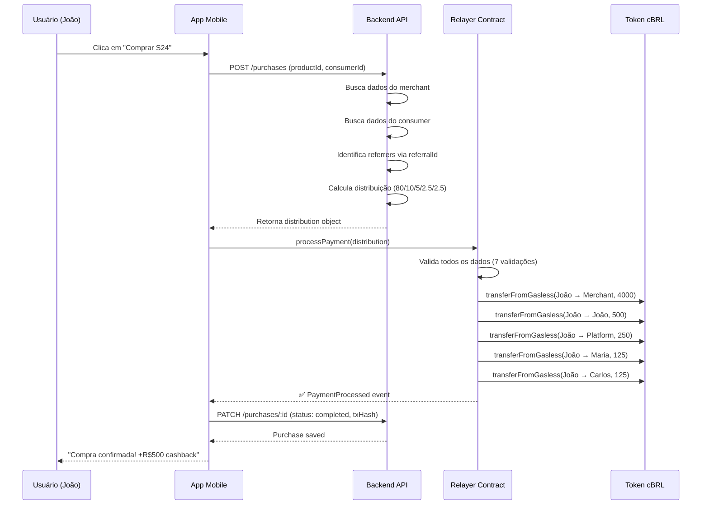

# Resumo Executivo: Sistema Relayer para Clube Digital

## Por que usar o Relayer?

**Problema sem Relayer:**
- Uma compra de R$ 5.000 geraria **6 transações separadas** na blockchain
- Se uma transação falhar (ex: falta de saldo de um referrer), as outras já foram processadas
- **Risco de fraude**: Merchant pode receber o pagamento mas consumidor não receber o cashback
- Usuário precisa aguardar e confirmar múltiplas transações

**Solução com Relayer:**
- **1 única transação** que distribui para todos automaticamente
- **Tudo ou nada**: Se qualquer parte falhar, nada acontece (proteção total)
- **Transparente para o usuário**: Ele só clica em "Comprar"
- **Gasless**: Não precisa aprovar gastos, tudo automático

---

## Como Funciona na Prática

### Exemplo Real: Compra de Galaxy S24 por R$ 5.000

**1. Usuário no App:**
```
João vê o Galaxy S24 por R$ 5.000,00
Clica em "Comprar"
App mostra: "Você receberá R$ 500 de cashback!"
João confirma a compra
```

**2. Nos bastidores (backend):**
```
Sistema identifica:
├─ Merchant (Loja TechShop): vai receber R$ 4.000 (80%)
├─ João (consumidor): vai receber R$ 500 de cashback (10%)
├─ Plataforma: vai receber R$ 250 de taxa (5%)
├─ Maria (indicou João): vai receber R$ 125 (2,5%)
└─ Carlos (indicou a loja): vai receber R$ 125 (2,5%)

Total: R$ 5.000 ✓
```

**3. Blockchain (invisível para João):**
```
Relayer recebe a ordem de distribuição
Valida todos os dados automaticamente:
  ✓ João tem R$ 5.000 em cBRL?
  ✓ Todos os endereços são válidos?
  ✓ Soma está correta?

Em 1 ÚNICA TRANSAÇÃO distribui:
  R$ 5.000 (João) → R$ 4.000 (TechShop)
                  → R$ 500 (João - cashback)
                  → R$ 250 (Plataforma)
                  → R$ 125 (Maria)
                  → R$ 125 (Carlos)

✅ Transação confirmada em segundos
```

**4. João recebe notificação:**
```
"Compra confirmada!
Você ganhou R$ 500 de cashback
Galaxy S24 a caminho 🎉"
```

---

## Benefícios Técnicos

| Aspecto | Sem Relayer | Com Relayer |
|---------|-------------|-------------|
| **Transações** | 6 separadas | 1 única |
| **Tempo** | ~60 segundos | ~10 segundos |
| **Segurança** | Risco de fraude | 100% atômico |
| **Custo de gas** | 6x mais caro | 4x mais barato |
| **UX usuário** | Péssima (6 confirmações) | Excelente (1 clique) |
| **Reversibilidade** | Parcial (problema!) | Total (seguro) |

---

## Segurança Garantida

O contrato Relayer tem **7 camadas de validação**:
1. ✓ Apenas o comprador pode executar
2. ✓ Todos os endereços são válidos
3. ✓ Endereços são únicos (não pode pagar pra si mesmo)
4. ✓ Valores maiores que zero
5. ✓ Soma das partes = total exato
6. ✓ Endereço da plataforma correto
7. ✓ Comprador tem saldo suficiente

**Se QUALQUER validação falhar → transação inteira é cancelada**

---

## Tecnologia Diferenciada

Nosso token cBRL tem função especial `transferFromGasless()`:
- ✅ Relayer tem permissão especial (`TRANSFER_ROLE`)
- ✅ Pode distribuir sem o usuário precisar "aprovar" antes
- ✅ Experiência igual a PIX: clicou, pagou, pronto

**Comparação:**
- Outros tokens: `approve()` → espera → `transfer()` (2 transações)
- Nosso cBRL: `transferFromGasless()` direto (1 transação)

---

## Conclusão para o Gestor

**"O Relayer é como um caixa automático que recebe R$ 5.000 e distribui automaticamente para 5 pessoas diferentes em 1 segundo. Se qualquer distribuição falhar (ex: endereço errado), o dinheiro volta inteiro para o comprador. É impossível roubar ou perder dinheiro no meio do caminho."**

**Vantagens do negócio:**
- ✅ Experiência de compra igual a qualquer e-commerce
- ✅ Cashback garantido instantaneamente
- ✅ Zero risco de fraude na distribuição
- ✅ Transparência total (tudo registrado na blockchain)
- ✅ Custos operacionais 4x menores

---

## Fluxo Técnico Completo

### Para desenvolvedores



---

## Setup Técnico

### 1. Deploy do Relayer

```javascript
const relayer = await ClubeDigitalRelayer.deploy(
  cBRLTokenAddress,
  platformAddress,
  adminAddress
);
```

### 2. Conceder TRANSFER_ROLE

```javascript
const TRANSFER_ROLE = ethers.keccak256(
  ethers.toUtf8Bytes("TRANSFER_ROLE")
);
await cBRLToken.grantRole(TRANSFER_ROLE, relayer.address);
```

### 3. Backend prepara distribuição

```javascript
const distribution = {
  consumer: "0x123...",       // João
  merchant: "0x456...",       // TechShop
  platform: "0x789...",       // Clube Digital
  consumerReferrer: "0xabc...", // Maria
  merchantReferrer: "0xdef...", // Carlos
  totalAmount: parseUnits("5000", 18),
  merchantAmount: parseUnits("4000", 18),
  consumerCashback: parseUnits("500", 18),
  platformFee: parseUnits("250", 18),
  consumerReferrerFee: parseUnits("125", 18),
  merchantReferrerFee: parseUnits("125", 18)
};
```

### 4. Mobile chama o contrato

```javascript
const tx = await relayerContract.processPayment(distribution);
await tx.wait();
```

---

## Referências

- **Contrato Relayer**: `/contracts/ClubeDigitalRelayer.sol`
- **Documentação Completa**: `/docs/CORE-BUSINESS.md`
- **Token cBRL**: `/apps/api/src/contracts/token.sol`
- **Status do Projeto**: `/docs/PROJECT-STATUS.md`

---

**Última atualização**: 2025-11-06
